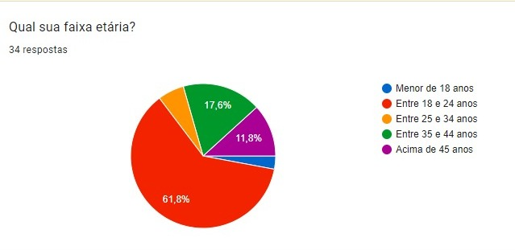
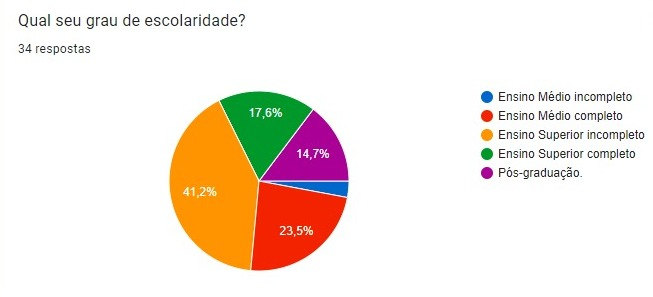
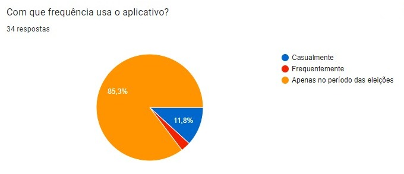
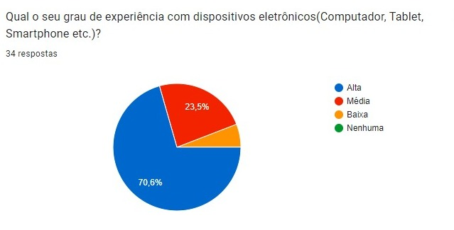
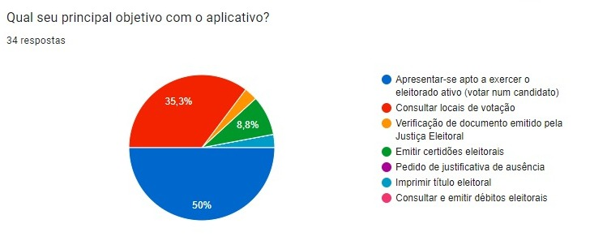
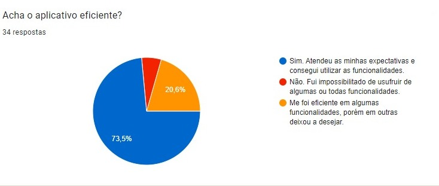
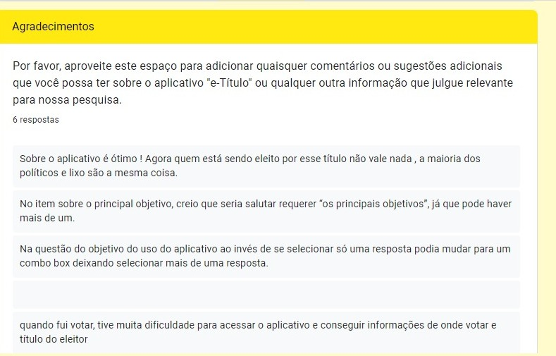

# Perfil do Usuário

## Conceito

É uma forma de apurar as características do público que utiliza a aplicação. Além de nos ajudar a entender para quem estamos construindo o produto. O perfil de usuários também auxilia no recrutamento de participantes para futuras atividades de análise e avaliação
## Metodologia

Para a obtenção dos dados utilizados na análise, foi elaborado um [questionário através do Google Froms](https://docs.google.com/forms/d/11JEPqsZy4FQklHAOHqySzfJWQVKZaaVKSmVSmzKPiV0/prefill). Neste questionário haviam 7 questões que focavam em entender as características do usuário e os motivos que o fazia utilizar o e-Título, além de um campo aberto no final do formulário, onde ele poderia adicionar comentários adicionais acerca do aplicativo. Como forma de divulgação foram utilizados aplicativos de mensagem, como: Whatsapp e Telegram.

## Resultado do Questionário

Com duração de 5 dias, o questionário obteve um total de 34 respostas. Sobre esse assunto, de acordo com o termo de consentimento dos participantes, 
os resultados das respostas serão apresentados a seguir da figura 1 a 7.

**Figura 1** - Questão 1.

De acordo com o gráfico da figura 1 pode-se concluir que mais de 60% dos participantes possuiem entre 18 e 24 anos.

**Figura 2** - Questão 2.

Já por outro lado, temos na figura 2 a informação que diz que o grau de escolaridade da maioria é o ensino superior incompleto com 41,2% e em segundo lugar temos a opção de ensino médio completo, com 23,5%.

**Figura 3** - Questão 3.

De acordo com a figura 3, pode-se observar o fato de que a maioria do público votante é masculino.

**Figura 4** - Questão 4.

Como pode-se notar, a maioria esmagadora do gráfico da figura 4 utiliza o aplicativo apenas no periodo das eleições, e uma pequena parcela (11%), usa de forma casual.

**Figura 5** - Questão 5.

De acordo com a figura 5, temos a maioria com alto grau de experiência com dispositivos eletronicos e a minoria com média e baixa experiência.

**Figura 6** - Questão 6.

Referente a figura 6 podemos notar que metade dos usuários usam *EXCLUSIVAMENTE* para apresentar-se apto a exercer o eleitorado ativo, o restante se divide entres as outras opções. Porém, nao há nenhum usuário que utilizapara pedido de justificativa de ausência.

**Figura 7** - Questão 7.

Aqui temos a última pergunta do questionário, onde podemos ver que a maioria esteve satisfeita com as funcionalidades do aplicativo. Por outro lado, houve quase 6% que ficaram insatisfeitos, e o restante achou eficiente mas com capacidade de melhoria.

**Figura 8** - Agradecimentos.

Por fim, podemos visualizar a caixa de resposta deixada aos participanetes para que pudessem se manifestar por meio de agradecimentos ou sugestões.

></iframe>

Fonte: [João Costa](https://github.com/jvcostta) e [Mateus Orlando](https://github.com/MateusPy).

</figure>

## Definição do Perfil

É importante ressaltar que o formulário foi respondido, também, por usuários que utilizam o aplicativo em meio de trabalho.

Após examinar as respostas, foi elaborado um perfil de usuário para o aplicativo com as descrições a seguir:
- Idade: Entre 18 e 24 anos.
- Escolaridade: Ensino superior completo.
- Gênero: Em sua maioria masculino.
- Experiência: Experiente.
- Tarefas primárias: Apresentar-se apto a exercer o eleitorado ativo .
- Satisfeito: Sim.

## Referências Bibliografia 

> <a id="FRM1" href="#anchor_1">1.</a> (Courage e Baxter, 2005; Hackos e Redish, 1998).
> <a id="FRM1" href="#anchor_1">2.</a> questionário).

## Bibliografia

> Simone D.J. Barbosa. Interação Humano-Computado  [https://leanpub.com/ihc-ux] (https://leanpub.com/ihc-ux). Acesso em: 25 set. 2023.
> Marques, Gabriel Campello. Perfil do Usuário. Repositório da disciplina de Requisitos de Software da Universidade de Brasília, 2023. Disponível em: [https://github.com/Requisitos-de-Software/2023.1-BilheteriaDigital/blob/main/docs/elicitacao/perfil_de_usuario.md](https://github.com/Requisitos-de-Software/2023.1-BilheteriaDigital/blob/main/docs/elicitacao/perfil_de_usuario.md). Acesso em: 25 set. 2023.

## Histórico de Versão

| Versão | Data       | Descrição                           | Autor(es)                                                                                           | Revisor(es)                                                                                                    |
| ------ | ---------- | ----------------------------------- | --------------------------------------------------------------------------------------------------- | -------------------------------------------------------------------------------------------------------------- |
| `1.0`  | 27/09/2023 | Criação da introdução e da metodologia.                  | [Matheus Orlando](https://github.com/MateusPy) e [João Victor](https://github.com/jvcostta) | [Maria Marques](https://github.com/EduardaSMarques) e [Mariiana Siqueira](https://github.com/Maryyscreuza) |
| `2.0`  | 02/10/2023 | Adicionando resultados do questionário                  | [Matheus Orlando](https://github.com/MateusPy) e [João Victor](https://github.com/jvcostta) | [Maria Marques](https://github.com/EduardaSMarques) e [Mariiana Siqueira](https://github.com/Maryyscreuza)|
| `3.0`  | 03/10/2023 | Adicionando resultados do questionário                  | [Matheus Orlando](https://github.com/MateusPy) e [João Victor](https://github.com/jvcostta) | [Maria Marques](https://github.com/EduardaSMarques) e [Mariiana Siqueira](https://github.com/Maryyscreuza) |
| `4.0`  | 04/10/2023 | Atualizando histórico de versão                  | [Matheus Orlando](https://github.com/MateusPy) e [João Victor](https://github.com/jvcostta) | [Maria Marques](https://github.com/EduardaSMarques) e [Mariiana Siqueira](https://github.com/Maryyscreuza) |
