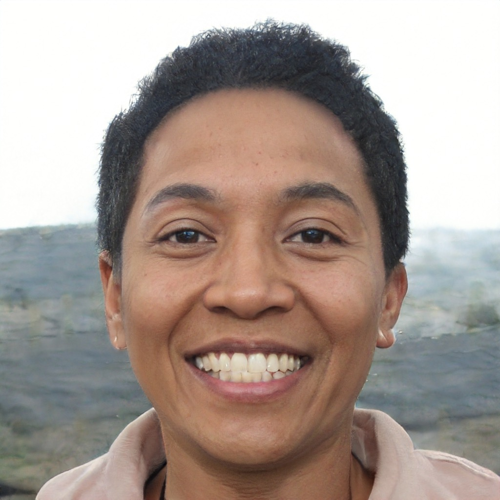

# Personas

## Conceito

Persona, trata-se de uma  representação fictícia do cliente ideal, fundamentada em dados reais sobre o comportamento e as características demográficas dos seus clientes. Ela inclui a criação de histórias pessoais, motivações, metas, desafios e preocupações dessa persona.

## Aplicação

Para utilizar personas em um projeto, se faz necessário a identificação das caractéristicas mais incidentes dos usuários(Sexo, Idade, escolaridade, etc). Após esta apuração, pessoas imaginárias são formadas por meio destas características. Sendo assim, as personas são criadas com base no perfil real dos usuários do sistema. Cabe ressaltar que, essas personas necessitam ter características diferentes uma da outra, para que uma maior quantidade de usuários reais sejam representados. 

## Metodologia

Como embasamento para a construção das personas e da antipersona, foram utilizadas as respostas ao questionário acerca do Perfil do usuário. Para o projeto, foram definidas 3 personas e 1 antipersona, pois acreditamos que seja o suficiente para representar a maioria dos usuários, visto que, durante a pesquisa foi constatada pouca diversidade entre os usuários. Para a representação física das personas, foi utilizado o site de criação de pessoas fictícias This Person Doesn't Exist.

## Elenco

Personas e antipersona estão respresentadas nas tabelas de 1 a 4, apresentadas abaixo.

<b>Tabela 1</b> - Persona Primária Felipe Augusto.

|Persona Primária|Felipe Augusto|
| :--:|:--:|
| **Foto**:|  
Figura 1: Felipe Augusto                                                                                                                                                      |
| **Nome**:| Felipe Augusto.                                                                                                                                                                                                             |                                                                                                                                                                                                        |
| **Características**:| Homem, 22 anos,  graduando em Administração e estagiário em um corretora de imóveis.                                                                                                                             |
| **Habilidades e Experiências**:| Conhecimento básico de vendas e gestão de empresas.                                                                                                                                                   |
| **Relacionamento**:| Equipe de vendas da imobiliária, familiares e amigos da época de colégio.                                                                                                                                         |
| **Objetivo**:| Ele é determinado, focado e persistente. Almeja passar em algum concurso público na área bancária.                                                                                                                      |
| **Expectativa**:| Como Felipe está focado na construção de uma carreira sólida e próspera, ele não liga muito para o período eleitoral e apenas entra no aplicativo para acessar o local de votação no período das eleições.           |
| **Requisitos**:| Ao chegar o período eleitoral, Felipe entra no e-Título e verifica o seu local de votação e apresentar-se apto para excercer o eleitorado ativo.                                                                                                                            |                                                                                                                     
| **Tarefas**:| Ir para a Faculdade na parte da manhã, almoçar, trabalhar na parte da tarde até o fim do horário comercial, ir para academia, malhar, voltar para casa jantar e usar as redes sociais até dormir.                        |                                                                                                                                                                                                           

Fonte: [Mateus Orlando](https://github.com/MateusPy) e [João Costa](https://github.com/jvcostta).

<b>Tabela 2</b> - Persona Secundária Diego Carvalho

|Persona Primária|Diego Carvalho|
| :--:|:--:|
| **Foto**:|  
Figura 2: Diego Carvalho                                                                                                                                                      |
| **Nome**:| Diego Carvalho.                                                                                                                                                                                                             |                                                                                                                                                                                                        |
| **Características**:| Homem, 36 anos, formado em direito na UFMG e servidor do TSE(Tribunal Superior Eleitoral).                                                                                                                             |
| **Habilidades e Experiências**:| Conhecimento avançado sobre constituição, poder executivo e legislativo. Perfil de liderança.                                                                                                                                                   |
| **Relacionamento**:| Presidente do Brasil, ministros, familiares e amigos da época da faculdade.                                                                                                                                         |
| **Objetivo**:| Ele é muito inteligente e pensa no futuro. Deseja instruir seus filhos para seguirem o mesmo caminho, pois seus conhecimentos facilitariam o trajeto.                                                                                                                    |
| **Expectativa**:| Diego trabalha no TSE e está o tempo inteiro utilizando dados relacionados a votação. Portanto, está constantemente verificando os documentos emitidos pela Justiça Eleitoral.         |
| **Requisitos**:| Durante a semana no trabalho, Diego entra no e-Título e verifica diversos documentos emitidos.                                                                                                                            |                                                                                                                     
| **Tarefas**:|  | Pela manhã gosta de olhar como anda seus investimentos na bolsa de valores e após o almoço trabalha 7 horas, apenas em dias úteis no periodo da tarde. Quando chega em casa a noite gosta de ter um tempo com a família, assistindo series, filmes ou cozinhando.                                                                                                                                                                                                          

Fonte: [Mateus Orlando](https://github.com/MateusPy) e [João Costa](https://github.com/jvcostta).

---

<b>Tabela 3</b> - Persona Secundária Maria Andrade

|Persona Secundária|Maria Andrade|
| :--:|:--:|
| **Foto**:|  
Figura 3: Maria Andrade.                                                                                                                                                                                                                        |
| **Nome**:| Maria Andrade.                                                                                                                                                                                                                                                                                |                                                                                                                                                                                                        |
| **Características**:| Mulher, 45 anos, pós-graduada em letras e professora na rede pública                                                                                                                                                                                                               |
| **Habilidades e Experiências**:| Conhecimento avançado em português e grande repertório sobre literatura brasileira                                                                                                                                                                                      |
| **Relacionamento**:| Viúva, filhos, netos, irmãos e primos.                                                                                                                                                                                                                                              |
| **Objetivo**:| Ela ja contribuiu bastante para o estado com seu conhecimento. Sonha em se aposentar e viajar bastante.                                                                                                                                                                                  |
| **Expectativa**:| Devido o fato de Maria pertencer a uma era não tão tecnológica, ela prefere os papéis físicos, portanto pretende usar o aplicativo para imprimir o título eleitoral.                                                                                                                  |
| **Requisitos**:| Ao chegar o período eleitoral, Maria entra no e-Título e com ajuda de conhecidos emite o documento para impressão.                                                                                                                                                                      |                                                                                                                     
| **Tarefas**:| Acorda as 5 horas, prepara o café para alguns netos, lê o jornal do dia até as 8 horas. Em sequencia prepara o almoço e enquanto não fica pronto faz outras tarefas domésticas. Durante a tarde assiste a novela, faz outra refeição, toma banho e antes de dormir lê seu livro do mês      |                                                                                                                                                                                                           

Fonte: [Mateus Orlando](https://github.com/MateusPy) e [João Costa](https://github.com/jvcostta).

---

|antiPersona|Enzo Rodrigues|
| :--:|:--:|
| **Foto**:|  
Figura 3: Enzo Rodrigues.                                                                                                                                                                                                                        |
| **Nome**:| Enzo Rodrigues.                                                                                                                                                                                                                                                                                |                                                                                                                                                                                                        |
| **Características**:| Homem, 14 anos, estudante do ensino fundamental.                                                                                                                                                                                                             |
| **Habilidades e Experiências**:| Conhecimentos sobre futebol e videogames.                                                                                                                                                                                      |
| **Relacionamento**:| Pais, primos, amigos da escola e do condomínio.                                                                                                                                                                                                                                              |
| **Objetivo**:| Ambicioso, habilidoso e confiante, seu sonho é se tornar atacante do real madrid, clube de futebol espanhol.                                                                                                                                                                                  |
| **Expectativa**:| No Brasil, a lei permite o direito ao voto a todo cidadão alfabetizado, nascido no país ou naturalizado, com idade entre 18 e 70 anos, no qual é obrigado a votar. O voto é facultativo para jovens com 16 e 17 anos,  pessoas com mais de 70 anos e analfabetos. Portanto, vai usar o aplicativo pra apresentar-se apto a execer o eleitorado ativo.     |
| **Requisitos**:| Devido sua idade, é impossibilitado de fazer login no aplicativo.                                                                                                                                                               |                                                                                                                     
| **Tarefas**:| Acorda às 7 da manhã em dias úteis, vai pra escola e chega às 13h para almoçar em casa. Após o almoço ele assiste um pouco de série e fica jogando videogame ate às 18 horas. Logo em seguida vai comer, banhar e às 21 horas se tiver algum dever de casa pra entregar no dia seguinte ele vai fazê-lo. Quando acaba, mexe no celular até cair no sono      |                                                                                                                                                                                                          

Fonte: [Mateus Orlando](https://github.com/MateusPy) e [João Costa](https://github.com/jvcostta).

## Conclusão

Para melhor orientação na fase de elicitação de requisitos, foram definidas três personas como os principais usuários do sistema, às quais daremos nossa atenção principal. Além disso, também criamos uma antipersona para entender quem não é um usuário do sistema. A decisão de limitar o número de personas a três foi baseada na observação das necessidades dos usuários em relação ao aplicativo "e-título". Sobre esse assunto, as necessidades estavam se tornando cada vez mais semelhantes, já que o maior propósito do aplicativo é permitir que o usuário apresente-se apto para exercer o eleitorado ativo e consulte os locais de votação. 

## Referências
> Personas. Disponível em: <https://retraining.inf.ufsc.br/guia/app/classificacoes/tecnicas-de-elicitacao-de-requisitos/entidades/tecnicas-de-elicitacao-de-requisitos-personas>. Acesso em: 04/10/2023 out. 2023.

> This Person Does Not Exist.  Disponível em: <https://thispersondoesnotexist.com/>. Acesso em: 04/10/2023 out. 2023.

## Histórico de Versões

| Versão  |    Data    |                        Descrição                        |                                             Autor(es)                                             |                  Revisor(es)                   |
| :-----: | :--------: | :-----------------------------------------------------: | :-----------------------------------------------------------------------------------------------: | :--------------------------------------------: |
|  `1.0`  | 02/10/2023 |            Criação do documento de personas.            | [Matheus Orlando](https://github.com/MateusPy) e [João Victor](https://github.com/jvcostta)       | [Maria Marques](https://github.com/EduardaSMarques) e [Mariiana Siqueira](https://github.com/Maryyscreuza) |        
|  `1.1`  | 29/09/2023 |            Adição de informações das personas.          | [Matheus Orlando](https://github.com/MateusPy) e [João Victor](https://github.com/jvcostta)       | [Maria Marques](https://github.com/EduardaSMarques) e [Mariiana Siqueira](https://github.com/Maryyscreuza) |      
|  `1.2`  | 04/10/2023 |            Adição de antipersona                        | [Matheus Orlando](http2s://github.com/MateusPy) e [João Victor](https://github.com/jvcostta)       | [Maria Marques](https://github.com/EduardaSMarques) e [Mariiana Siqueira](https://github.com/Maryyscreuza) |
|  `1.3`  | 04/10/2023 |            Revisão e edição de ortografia               | [Mariiana Siqueira](https://github.com/Maryyscreuza)  | [Maria Marques](https://github.com/EduardaSMarques) e [Mariiana Siqueira](https://github.com/Maryyscreuza) |
