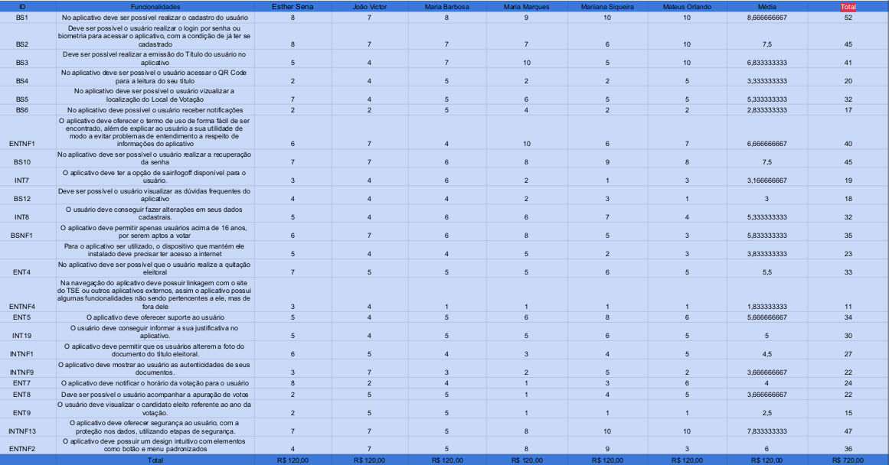

# $100

## Introdução
É importante utilizar uma técnica de priorização para dar prioridade às tarefas mais importantes a serem implementadas. Será apresentado neste artefato a técnica $100 e como vamos utilizá-lo no projeto.

## Motivação e Objetivo
A motivação de se usar a técnica $100, deve-se ao fato de que a técnica ajuda a tornar a priorização mais concreta, expressando-a em termos de um recurso real: dinheiro, fazendo com que a equipe pense em termos de alocação de recursos com base na prioridade. Isso contribui para o sucesso geral do projeto e ajuda a evitar o desperdício de tempo e recursos em requistos menos críticos, maximizando as chances de sucesso. Dessa forma, o objetivo principal de se usar a técnica $100 é devido à sua eficácia.  <a id=anchor_1 href="#REF1">[1]</a>

## Metodologia
* 1 - Foi montado uma planilha com todos os requisitos elicitados;
* 2 - Explicamos para toda a equipe como funciona a técnica de priorização $100;
* 3 - Definimos o limite de $120;
* 4 - Todos distribuíram a quantia total entre os requisitos, sem passar do limite de $120;
* 5 - Somamos a quantia de cada requisito e e dividimos por 6 para a média, assim conseguimos priorizar os requisitos de maior valor.

## Requisitos Elicitados

Na Tabela 1 estão registrados todos os requisitos elicitados durante o processo de [elicitação](https://github.com/Requisitos-de-Software/2023.2-e-Titulo/tree/feature-Backlogs/docs/elicitacao/tecnicas), juntamente com a origem de cada requisito.

### Legenda:
* BS: Requisitos de Brainstorming
* BSNF: Requisitos não-funcionais de Brainstorming
* ENT: Requisitos de Entrevista
* ENTNF: Requisitos não-funcionais de Entrevista
* INT: Requisitos de Introspecção
* INTNF: Requisitos não-funcionais de Introspecção

 Tabela 1: Requisitos elicitados 

  
| Identificador | Requisito | Rastreabilidade |
| :-: | :-: | :-: |
| <a id=anchor_2 href="#RF01">RF01</a> | No aplicativo deve ser possível realizar o cadastro do usuário. | [BS1](https://github.com/Requisitos-de-Software/2023.2-e-Titulo/blob/main/docs/elicitacao/tecnicas/brainstorming.md) |
| <a id=anchor_3 href="#RF02">RF02</a> | Deve ser possível o usuário realizar o login por senha ou biometria para acessar o aplicativo, com a condição de já ter se cadastrado. | [BS2](https://github.com/Requisitos-de-Software/2023.2-e-Titulo/blob/main/docs/elicitacao/tecnicas/brainstorming.md) |
| <a id=anchor_4 href="#RF03">RF03</a> | Deve ser possível realizar a emissão do Título do usuário no aplicativo. | [BS3](https://github.com/Requisitos-de-Software/2023.2-e-Titulo/blob/main/docs/elicitacao/tecnicas/brainstorming.md) |
| <a id=anchor_5 href="#RF04">RF04</a> | No aplicativo deve ser possível o usuário acessar o QR Code para a leitura do seu título. | [BS4](https://github.com/Requisitos-de-Software/2023.2-e-Titulo/blob/main/docs/elicitacao/tecnicas/brainstorming.md) |
| <a id=anchor_6 href="#RF05">RF05</a> | No aplicativo deve ser possível o usuário vizualizar a localização do Local de Votação. | [BS5](https://github.com/Requisitos-de-Software/2023.2-e-Titulo/blob/main/docs/elicitacao/tecnicas/brainstorming.md) |
| <a id=anchor_7 href="#RF06">RF06</a> | No aplicativo deve possível o usuário receber notificações. | [BS6](https://github.com/Requisitos-de-Software/2023.2-e-Titulo/blob/main/docs/elicitacao/tecnicas/brainstorming.md) |
| <a id=anchor_8 href="#RF07">RF07</a> | O aplicativo deve oferecer o termo de uso de forma fácil de ser encontrado, além de explicar ao usuário a sua utilidade de modo a evitar problemas de entendimento a respeito de informações do aplicativo. | [ENTNF1](https://github.com/Requisitos-de-Software/2023.2-e-Titulo/blob/main/docs/elicitacao/tecnicas/entrevista.md) |
| <a id=anchor_9 href="#RF08">RF08</a> | No aplicativo deve ser possível o usuário realizar a recuperação da senha. | [BS10](https://github.com/Requisitos-de-Software/2023.2-e-Titulo/blob/main/docs/elicitacao/tecnicas/brainstorming.md)|
| <a id=anchor_10 href="#RF09">RF09</a> | O aplicativo deve ter a opção de sair/logoff disponível para o usuário. | [INT7](https://github.com/Requisitos-de-Software/2023.2-e-Titulo/blob/main/docs/elicitacao/tecnicas/introspeccao.md) |
| <a id=anchor_11 href="#RF10">RF10</a> | Deve ser possível o usuário visualizar as dúvidas frequentes do aplicativo. | [BS12](https://github.com/Requisitos-de-Software/2023.2-e-Titulo/blob/main/docs/elicitacao/tecnicas/brainstorming.md)|
| <a id=anchor_12 href="#RF11">RF11</a> | O usuário deve conseguir fazer alterações em seus dados cadastrais. | [INT8](https://github.com/Requisitos-de-Software/2023.2-e-Titulo/blob/main/docs/elicitacao/tecnicas/introspeccao.md) |
| <a id=anchor_13 href="#RF12">RF12</a> | O aplicativo deve permitir apenas usuários acima de 16 anos, por serem aptos a votar. | [BSNF1](https://github.com/Requisitos-de-Software/2023.2-e-Titulo/blob/main/docs/elicitacao/tecnicas/brainstorming.md) |
| <a id=anchor_14 href="#RF13">RF13</a> | Para o aplicativo ser utilizado, o dispositivo que mantém ele instalado deve precisar ter acesso a internet. | [BSNF4](https://github.com/Requisitos-de-Software/2023.2-e-Titulo/blob/main/docs/elicitacao/tecnicas/brainstorming.md) |
| <a id=anchor_2 href="#RF01">RF01</a> | No aplicativo deve ser possível que o usuário realize a quitação eleitoral. | [ENT4](https://github.com/Requisitos-de-Software/2023.2-e-Titulo/blob/main/docs/elicitacao/tecnicas/entrevista.md) |
| RF15 | Na navegação do aplicativo deve possuir linkagem com o site do TSE ou outros aplicativos externos, assim o aplicativo possui algumas funcionalidades não sendo pertencentes a ele, mas de fora dele. | [ENTNF4](https://github.com/Requisitos-de-Software/2023.2-e-Titulo/blob/main/docs/elicitacao/tecnicas/entrevista.md) |
| RF16 | O aplicativo deve oferecer suporte ao usuário. | [ENT5](https://github.com/Requisitos-de-Software/2023.2-e-Titulo/blob/main/docs/elicitacao/tecnicas/entrevista.md) |
| RF17 | O usuário deve conseguir informar a sua justificativa no aplicativo. | [INT19](https://github.com/Requisitos-de-Software/2023.2-e-Titulo/blob/main/docs/elicitacao/tecnicas/introspeccao.md) |
| RF18 | O aplicativo deve permitir que os usuários alterem a foto do documento do título eleitoral. | [INTNF1](https://github.com/Requisitos-de-Software/2023.2-e-Titulo/blob/main/docs/elicitacao/tecnicas/introspeccao.md) |
| RF19 |O aplicativo deve mostrar ao usuário as autenticidades de seus documentos. | [INTNF9](https://github.com/Requisitos-de-Software/2023.2-e-Titulo/blob/main/docs/elicitacao/tecnicas/introspeccao.md) |
| RF20 | O aplicativo deve notificar o horário da votação para o usuário. | [ENT7](https://github.com/Requisitos-de-Software/2023.2-e-Titulo/blob/main/docs/elicitacao/tecnicas/entrevista.md) |
| RF21 | Deve ser possível o usuário acompanhar a apuração de votos.| [ENT8](https://github.com/Requisitos-de-Software/2023.2-e-Titulo/blob/main/docs/elicitacao/tecnicas/entrevista.md) |
| RF22 | O usuário deve visualizar o candidato eleito referente ao ano da votação. | [ENT9](https://github.com/Requisitos-de-Software/2023.2-e-Titulo/blob/main/docs/elicitacao/tecnicas/entrevista.md) |
| RF23 | O aplicativo deve oferecer segurança ao usuário, com a proteção nos dados, utilizando etapas de segurança. | [INTNF13](https://github.com/Requisitos-de-Software/2023.2-e-Titulo/blob/main/docs/elicitacao/tecnicas/introspeccao.md) |
| RF24 | O aplicativo deve possuir um design intuitivo com elementos como botão e menu padronizados. | [ENTNF2](https://github.com/Requisitos-de-Software/2023.2-e-Titulo/blob/main/docs/elicitacao/tecnicas/entrevista.md) |

Fonte: [SIQUEIRA, Mariiana](https://github.com/Maryyscreuza) e [MARQUES, Maria Eduarda](https://github.com/EduardaSMarques). 2023.

## Resultados

A Figura 1 contém a priorização dos requisitos elicitados utilizando a técnica $100. Nem todos os requisitos estão presentes na tabela pois diferentes métodos elicitaram requisitos semelhantes.

### Link para planilha: 
https://docs.google.com/spreadsheets/d/1lackwYkvmG7F8B8kSGfr2Wpnu8AmoNCcAiYS41mi0_8/edit#gid=0

| ID | Esther Sena | João Victor | Maria Barbosa | Maria Marques | Mariiana Siqueira | Mateus Orlando | Média | Total |
| :-: | :-: | :-: | :-: | :-: | :-: | :-: | :-: | :-: |
| <a id="RF01" href="#anchor_2">RF01</a> |  |  |  |  |  |  |  |  |
| <a id="RF02" href="#anchor_3">RF02</a> |  |  |  |  |  |  |  |  |
| <a id="RF03" href="#anchor_4">RF03</a> |  |  |  |  |  |  |  |  |
| <a id="RF04" href="#anchor_5">RF04</a> |  |  |  |  |  |  |  |  |
| <a id="RF05" href="#anchor_6">RF05</a> |  |  |  |  |  |  |  |  |
| <a id="RF06" href="#anchor_7">RF06</a> |  |  |  |  |  |  |  |  |
| <a id="RF07" href="#anchor_8">RF07</a> |  |  |  |  |  |  |  |  |
| <a id="RF08" href="#anchor_9">RF08</a> |  |  |  |  |  |  |  |  |
| RF09 |  |  |  |  |  |  |  |  |
| RF10 |  |  |  |  |  |  |  |  |
| RF11 |  |  |  |  |  |  |  |  |

Fonte: [SIQUEIRA, Mariiana](https://github.com/Maryyscreuza) e [MARQUES, Maria Eduarda](https://github.com/EduardaSMarques). 2023.

Figura 1: Priorização de requisitos utilizando a técnica $100.

Fonte: Planilhas; [SIQUEIRA, Mariiana](https://github.com/Maryyscreuza) e [MARQUES, Maria Eduarda](https://github.com/EduardaSMarques). 2023.

## Referência

> <a id="REF1" href="#anchor_1">[1]</a> WIEGERS, Karl e BEATTY, Joy. Software Requirements: third edition. Agosto de 2013. Disponível em: https://www.booksfree.org/wp-content/uploads/2022/03/Software_Requirements_3rd_Edition_compressed.pdf. Acesso em: 04 de out 2023.

## Histórico de Versões

| Versão |     Data    | Descrição   | Autor(es) | Revisor(es) |
| ------ | ----------- | ----------- | --------- | ----------- |
| `1.0`  | 03/10/2023  | Montagem do documento | [Maria Marques ](https://github.com/EduardaSMarques) e [Mariiana Siqueira](https://github.com/Maryyscreuza) | [Esther Sena](https://github.com/esmsena) e [Maria Barbosa](https://github.com/Madu01) |
| `1.1`  | 04/10/2023  | Adição de motivação e objetivo, metodologia, e resultados | [Maria Marques ](https://github.com/EduardaSMarques) e [Mariiana Siqueira](https://github.com/Maryyscreuza) | [Esther Sena](https://github.com/esmsena) e [Maria Barbosa](https://github.com/Madu01) |
