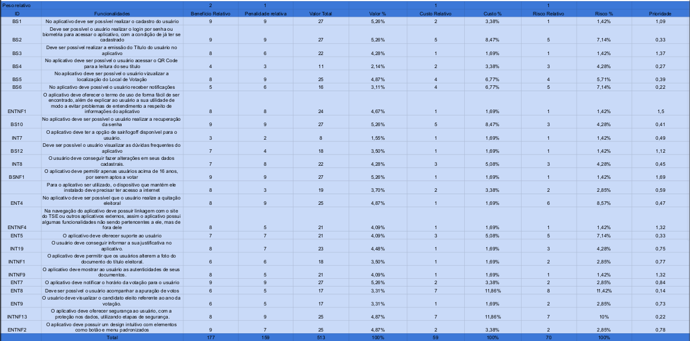

# First Things First

## Introdução
É importante utilizar uma técnica de priorização para dar prioridade às tarefas mais importantes a serem implementadas. Será apresentado neste artefato a técnica do FTF(First Things First) e como vamos utilizá-lo no projeto.

## Motivação e Objetivo

A motivação de se usar a técnica First Things First, deve-se ao fato de que a técnica ajuda a garantir que os recursos sejam alocados de forma eficaz desde o início do projeto, focando assim nos requistos que realmente importam. Isso contribui para o sucesso geral do projeto e ajuda a evitar o desperdício de tempo e recursos em requistos menos críticos, maximizando as chances de sucesso. Dessa forma, o objetivo principal de se usar a técnica FTF é devido à sua eficácia, proporcionando clareza, foco e direção às equipes de desenvolvimento.

## Metodologia

A técnica de priorização first things first (FTF) tem como objetivo apresentar em forma de tabela os riscos, custos, benefícios e a penalidade relativa de cada requisito elicitado para o projeto, estabelecendo uma ordem de prioridade de implementação. A seguir, são explicados os passos fundamentais para a elaboração dessa técnica, encontrados no livro na Referência[1]:

Passo 1: Listar todos os requisitos, funcionalidades ou casos de uso que você deseja priorizar em uma planilha;

Passo 2: Estimar o benefício relativo que cada funcionalidade oferece ao cliente ou ao negócio em uma escala de 1 a 9, sendo 1 indicando muito pouco benefício e 9 sendo o benefício máximo possível. 

Passo 3: Estime a penalização relativa que o cliente ou o negócio sofreria se a funcionalidade não fosse incluída. Novamente, use uma escala de 1 a 9, onde 1 significa essencialmente nenhuma penalização e 9 indica uma desvantagem muito séria.

Passo 4: A coluna "Valor Total" é a soma do benefício relativo e da penalização. Por padrão, benefício e penalização têm o mesmo peso. Como refinamento, alteramos o benefício relativo para peso 2, assim, todas as classificações de benefício têm o dobro do peso das classificações de penalização. A planilha totaliza os valores das funcionalidades e calcula a porcentagem do valor total do produto que é atribuída a cada funcionalidade.

Passo 5: Estime o custo relativo de implementar cada funcionalidade, novamente em uma escala de 1 a 9. A planilha calculará a porcentagem do custo total para cada funcionalidade. 

Passo 6: Os desenvolvedores estimam o grau relativo de risco técnico ou outro risco associado a cada funcionalidade em uma escala de 1 a 9. planilha calculará a porcentagem do risco total que vem de cada funcionalidade.

Passo 7: Calcular um número de prioridade para cada funcionalidade. A fórmula para a coluna de Prioridade é: prioridade = valor % / (custo % * peso do custo + risco % * peso do risco).

Passo 8: Ordenar a lista de funcionalidades em ordem decrescente de prioridade calculada. 

Para o passo 2 e passo 3 gravamos uma reunião na qual a [Mariiana Siqueira](https://github.com/Maryyscreuza) foi a gerente e utilizamos a persona Maria Andrade, interpretada por [Esther Sena](https://github.com/esmsena) como representante dos clientes, para a obtenção de respostas. Para o passo 5 e o passo 6 a gerente se reuniu com a representante dos desenvolvedores [Maria Eduarda Marques](https://github.com/EduardaSMarques) para montagem, porém não pôde ser gravado. Por fim, novamente foram reunidas [Mariiana Siqueira](https://github.com/Maryyscreuza) e [Maria Eduarda Marques](https://github.com/EduardaSMarques) para o total preenchimento da tabela.

## Requisitos Elicitados

Na Tabela 1 estão registrados todos os requisitos elicitados durante o processo de [elicitação](https://github.com/Requisitos-de-Software/2023.2-e-Titulo/tree/feature-Backlogs/docs/elicitacao/tecnicas), juntamente com a origem de cada requisito.

### Legenda:
* BS: Requisitos de Brainstorming
* BSNF: Requisitos não-funcionais de Brainstorming
* ENT: Requisitos de Entrevista
* ENTNF: Requisitos não-funcionais de Entrevista
* INT: Requisitos de Introspecção
* INTNF: Requisitos não-funcionais de Introspecção

 Tabela 1: Requisitos elicitados 

  
| Identificador | Requisito | Rastreabilidade |
| :-: | :-: | :-: |
| <a id=anchor_2 href="#RF01">RF01</a> | No aplicativo deve ser possível realizar o cadastro do usuário. | [BS1](https://github.com/Requisitos-de-Software/2023.2-e-Titulo/blob/main/docs/elicitacao/tecnicas/brainstorming.md) |
| <a id=anchor_3 href="#RF02">RF02</a> | Deve ser possível o usuário realizar o login por senha ou biometria para acessar o aplicativo, com a condição de já ter se cadastrado. | [BS2](https://github.com/Requisitos-de-Software/2023.2-e-Titulo/blob/main/docs/elicitacao/tecnicas/brainstorming.md) |
| <a id=anchor_4 href="#RF03">RF03</a> | Deve ser possível realizar a emissão do Título do usuário no aplicativo. | [BS3](https://github.com/Requisitos-de-Software/2023.2-e-Titulo/blob/main/docs/elicitacao/tecnicas/brainstorming.md) |
| <a id=anchor_5 href="#RF04">RF04</a> | No aplicativo deve ser possível o usuário acessar o QR Code para a leitura do seu título. | [BS4](https://github.com/Requisitos-de-Software/2023.2-e-Titulo/blob/main/docs/elicitacao/tecnicas/brainstorming.md) |
| <a id=anchor_6 href="#RF05">RF05</a> | No aplicativo deve ser possível o usuário vizualizar a localização do Local de Votação. | [BS5](https://github.com/Requisitos-de-Software/2023.2-e-Titulo/blob/main/docs/elicitacao/tecnicas/brainstorming.md) |
| <a id=anchor_7 href="#RF06">RF06</a> | No aplicativo deve possível o usuário receber notificações. | [BS6](https://github.com/Requisitos-de-Software/2023.2-e-Titulo/blob/main/docs/elicitacao/tecnicas/brainstorming.md) |
| <a id=anchor_8 href="#RF07">RF07</a> | O aplicativo deve oferecer o termo de uso de forma fácil de ser encontrado, além de explicar ao usuário a sua utilidade de modo a evitar problemas de entendimento a respeito de informações do aplicativo. | [ENTNF1](https://github.com/Requisitos-de-Software/2023.2-e-Titulo/blob/main/docs/elicitacao/tecnicas/entrevista.md) |
| <a id=anchor_9 href="#RF08">RF08</a> | No aplicativo deve ser possível o usuário realizar a recuperação da senha. | [BS10](https://github.com/Requisitos-de-Software/2023.2-e-Titulo/blob/main/docs/elicitacao/tecnicas/brainstorming.md)|
| <a id=anchor_10 href="#RF09">RF09</a> | O aplicativo deve ter a opção de sair/logoff disponível para o usuário. | [INT7](https://github.com/Requisitos-de-Software/2023.2-e-Titulo/blob/main/docs/elicitacao/tecnicas/introspeccao.md) |
| <a id=anchor_11 href="#RF10">RF10</a> | Deve ser possível o usuário visualizar as dúvidas frequentes do aplicativo. | [BS12](https://github.com/Requisitos-de-Software/2023.2-e-Titulo/blob/main/docs/elicitacao/tecnicas/brainstorming.md)|
| <a id=anchor_12 href="#RF11">RF11</a> | O usuário deve conseguir fazer alterações em seus dados cadastrais. | [INT8](https://github.com/Requisitos-de-Software/2023.2-e-Titulo/blob/main/docs/elicitacao/tecnicas/introspeccao.md) |
| <a id=anchor_13 href="#RF12">RF12</a> | O aplicativo deve permitir apenas usuários acima de 16 anos, por serem aptos a votar. | [BSNF1](https://github.com/Requisitos-de-Software/2023.2-e-Titulo/blob/main/docs/elicitacao/tecnicas/brainstorming.md) |
| <a id=anchor_14 href="#RF13">RF13</a> | Para o aplicativo ser utilizado, o dispositivo que mantém ele instalado deve precisar ter acesso a internet. | [BSNF4](https://github.com/Requisitos-de-Software/2023.2-e-Titulo/blob/main/docs/elicitacao/tecnicas/brainstorming.md) |
| <a id=anchor_15 href="#RF14">RF14</a> | No aplicativo deve ser possível que o usuário realize a quitação eleitoral. | [ENT4](https://github.com/Requisitos-de-Software/2023.2-e-Titulo/blob/main/docs/elicitacao/tecnicas/entrevista.md) |
| <a id=anchor_16 href="#RF15">RF15</a> | Na navegação do aplicativo deve possuir linkagem com o site do TSE ou outros aplicativos externos, assim o aplicativo possui algumas funcionalidades não sendo pertencentes a ele, mas de fora dele. | [ENTNF4](https://github.com/Requisitos-de-Software/2023.2-e-Titulo/blob/main/docs/elicitacao/tecnicas/entrevista.md) |
| <a id=anchor_17 href="#RF16">RF16</a> | O aplicativo deve oferecer suporte ao usuário. | [ENT5](https://github.com/Requisitos-de-Software/2023.2-e-Titulo/blob/main/docs/elicitacao/tecnicas/entrevista.md) |
| <a id=anchor_18 href="#RF17">RF17</a> | O usuário deve conseguir informar a sua justificativa no aplicativo. | [INT19](https://github.com/Requisitos-de-Software/2023.2-e-Titulo/blob/main/docs/elicitacao/tecnicas/introspeccao.md) |
| <a id=anchor_19 href="#RF18">RF18</a> | O aplicativo deve permitir que os usuários alterem a foto do documento do título eleitoral. | [INTNF1](https://github.com/Requisitos-de-Software/2023.2-e-Titulo/blob/main/docs/elicitacao/tecnicas/introspeccao.md) |
| <a id=anchor_20 href="#RF19">RF19</a> |O aplicativo deve mostrar ao usuário as autenticidades de seus documentos. | [INTNF9](https://github.com/Requisitos-de-Software/2023.2-e-Titulo/blob/main/docs/elicitacao/tecnicas/introspeccao.md) |
| <a id=anchor_21 href="#RF20">RF20</a> | O aplicativo deve notificar o horário da votação para o usuário. | [ENT7](https://github.com/Requisitos-de-Software/2023.2-e-Titulo/blob/main/docs/elicitacao/tecnicas/entrevista.md) |
| <a id=anchor_22 href="#RF21">RF21</a> | Deve ser possível o usuário acompanhar a apuração de votos.| [ENT8](https://github.com/Requisitos-de-Software/2023.2-e-Titulo/blob/main/docs/elicitacao/tecnicas/entrevista.md) |
| <a id=anchor_23 href="#RF22">RF22</a> | O usuário deve visualizar o candidato eleito referente ao ano da votação. | [ENT9](https://github.com/Requisitos-de-Software/2023.2-e-Titulo/blob/main/docs/elicitacao/tecnicas/entrevista.md) |
| <a id=anchor_24 href="#RF23">RF23</a> | O aplicativo deve oferecer segurança ao usuário, com a proteção nos dados, utilizando etapas de segurança. | [INTNF13](https://github.com/Requisitos-de-Software/2023.2-e-Titulo/blob/main/docs/elicitacao/tecnicas/introspeccao.md) |
| <a id=anchor_25 href="#RF24">RF24</a> | O aplicativo deve possuir um design intuitivo com elementos como botão e menu padronizados. | [ENTNF2](https://github.com/Requisitos-de-Software/2023.2-e-Titulo/blob/main/docs/elicitacao/tecnicas/entrevista.md) |

Fonte: [SIQUEIRA, Mariiana](https://github.com/Maryyscreuza) e [MARQUES, Maria Eduarda](https://github.com/EduardaSMarques). 2023.

## Resultados

A Tabela 2 e a figura 1, contém a priorização dos requisitos elicitados utilizando a técnica First Things First. Nem todos os requisitos estão presentes na tabela pois diferentes métodos elicitaram requisitos semelhantes.

### Link para planilha: 
[https://docs.google.com/spreadsheets/d/1IaulZhzmAaYoMchSbfAYqr7WoQPFcA7TdL3vA5ieUT4/edit#gid=0](https://docs.google.com/spreadsheets/d/1IaulZhzmAaYoMchSbfAYqr7WoQPFcA7TdL3vA5ieUT4/edit#gid=0)

Tabela 2: Priorização de requisitos utilizando a técnica First Things First.
| Peso relativo | | 2 | 1 | |  | 1 |  | 1 |  | |
| :-:| :-: | :-: | :-: | :-: | :-: | :-: | :-: | :-: | :-: | :-: |
| | **ID** | **Benefício Relativo** | **Penalidade Relativa** | **Valor Total** | **Valor %** | **Custo Relativo** | **Custo %** | **Risco Relativo**  | **Risco %** |**Prioridade** |
| | <a id="RF01" href="#anchor_2">RF01</a> |  |  |  |  |  |  |  |  | |
| | <a id="RF02" href="#anchor_3">RF02</a> |  |  |  |  |  |  |  |  | |
| | <a id="RF03" href="#anchor_4">RF03</a> |  |  |  |  |  |  |  |  | |
| | <a id="RF04" href="#anchor_5">RF04</a> |  |  |  |  |  |  |  |  | |
| | <a id="RF05" href="#anchor_6">RF05</a> |  |  |  |  |  |  |  |  | |
| | <a id="RF06" href="#anchor_7">RF06</a> |  |  |  |  |  |  |  |  | |
| | <a id="RF07" href="#anchor_8">RF07</a> |  |  |  |  |  |  |  |  | |
| | <a id="RF08" href="#anchor_9">RF08</a> |  |  |  |  |  |  |  |  | |
| | <a id="RF09" href="#anchor_10">RF09</a> |  |  |  |  |  |  |  |  | |
| | <a id="RF10" href="#anchor_11">RF10</a> |  |  |  |  |  |  |  |  | |
| | <a id="RF11" href="#anchor_12">RF11</a> |  |  |  |  |  |  |  |  | |
| | <a id="RF12" href="#anchor_13">RF12</a> |  |  |  |  |  |  |  |  | |
| | <a id="RF13" href="#anchor_14">RF13</a> |  |  |  |  |  |  |  |  | |
| | <a id="RF14" href="#anchor_15">RF14</a> |  |  |  |  |  |  |  |  | |
| | <a id="RF15" href="#anchor_16">RF15</a> |  |  |  |  |  |  |  |  | |
| | <a id="RF16" href="#anchor_17">RF16</a> |  |  |  |  |  |  |  |  | |
| | <a id="RF17" href="#anchor_18">RF17</a> |  |  |  |  |  |  |  |  | | 
| | <a id="RF18" href="#anchor_19">RF18</a> |  |  |  |  |  |  |  |  | |
| | <a id="RF19" href="#anchor_20">RF19</a> |  |  |  |  |  |  |  |  | |
| | <a id="RF20" href="#anchor_21">RF20</a> |  |  |  |  |  |  |  |  | |
| | <a id="RF21" href="#anchor_22">RF21</a> |  |  |  |  |  |  |  |  | |
| | <a id="RF22" href="#anchor_23">RF22</a> |  |  |  |  |  |  |  |  | |
| | <a id="RF23" href="#anchor_24">RF23</a> |  |  |  |  |  |  |  |  | |
| | <a id="RF24" href="#anchor_25">RF24</a> |  |  |  |  |  |  |  |  | |
| | **Total** |  |  |  |  |  |  |  |  | |

Fonte: [SIQUEIRA, Mariiana](https://github.com/Maryyscreuza) e [MARQUES, Maria Eduarda](https://github.com/EduardaSMarques). 2023.

Figura 1: Priorização de requisitos utilizando a técnica First Things First.

Fonte: Planilhas; SIQUEIRA, Mariiana e MARQUES, Maria Eduarda 2023.

## Gravação

Abaixo é onde se encontra a gravação da técnica.
[Link](https://youtu.be/H8lFp5S03gk)

## Referencia

> [1] WIEGER, Karl E. First Things First: Prioritizing Requirements. Setembro de 1999. Disponível em https://www.processimpact.com/articles/prioritizing.pdf. Acesso em: 02 de out 2023.

> 2023.1-VLC, First Things First. 01 mai 2023. Disponível em https://github.com/Requisitos-de-Software/2023.1-VLC/blob/master/docs/elicitacao/first_things_first.md. Acesso em: 04 de out 2023.
 
## Histórico de Versões

| Versão |     Data    | Descrição   | Autor(es) | Revisor(es) |
| ------ | ----------- | ----------- | --------- | ----------- |
| `1.0`  | 02/10/2023  | Realização da intro. , metologia e uma das técnicas  | [Maria Marques ](https://github.com/EduardaSMarques) e [Mariiana Siqueira](https://github.com/Maryyscreuza) | [Esther Sena](https://github.com/esmsena) e [Maria Barbosa](https://github.com/Madu01) |
| `1.1`  | 04/10/2023  | Edição de metodologia, adicionando a gravação | [Maria Marques ](https://github.com/EduardaSMarques) e [Mariiana Siqueira](https://github.com/Maryyscreuza) | [Esther Sena](https://github.com/esmsena) e [Maria Barbosa](https://github.com/Madu01) |
| `1.2`  | 04/10/2023  | Adicionando tabela do FTF | [Maria Marques ](https://github.com/EduardaSMarques) | [Esther Sena](https://github.com/esmsena) e [Maria Barbosa](https://github.com/Madu01) |
