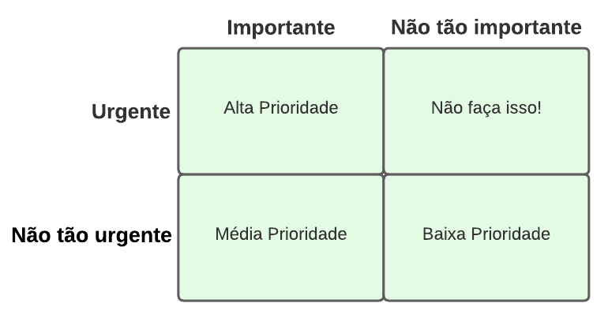
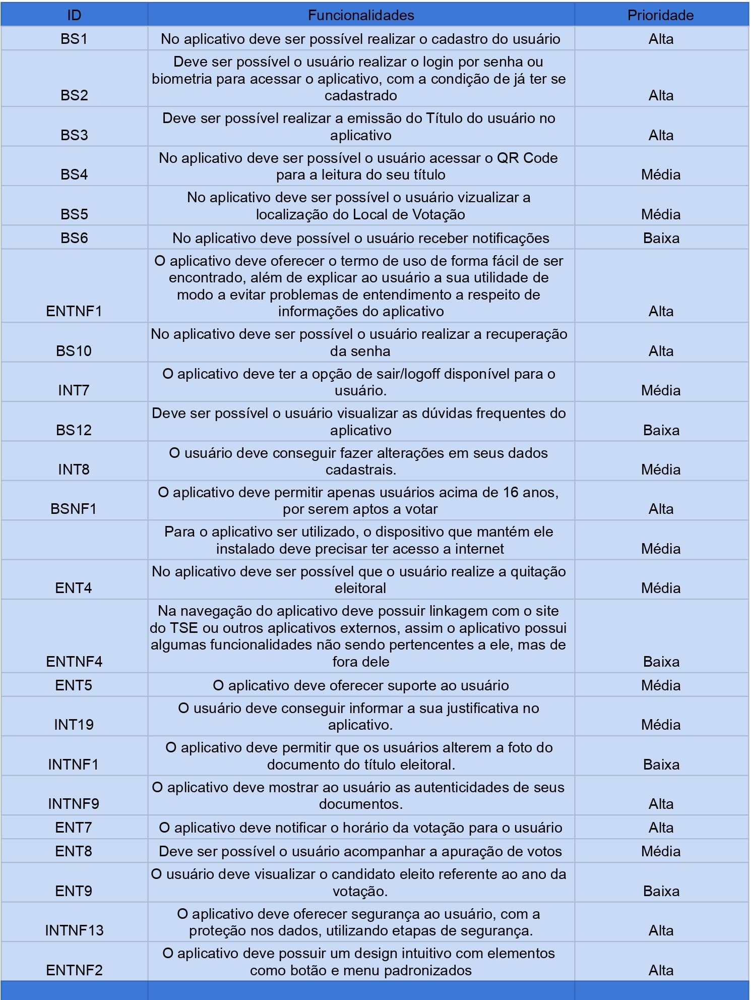

# Three Level Scale

## Introdução
É importante utilizar uma técnica de priorização para dar prioridade às tarefas mais importantes a serem implementadas. Será apresentado neste artefato a técnica do Three Level Scale (Escala de três níveis) e como vamos utilizá-lo no projeto.

## Motivação e Objetivo

A técnica Three-Level Scale em projetos de requisitos busca simplificar a identificação e classificação da importância dos requisitos. Isso é alcançado através de uma escala simples que permite a priorização eficaz, melhorando a comunicação entre as partes interessadas. Essa abordagem agiliza a tomada de decisões, otimizando o processo de seleção de requisitos e tornando as escolhas mais transparentes, baseadas em critérios claros e objetivos.

## Metodologia
Uma forma de avaliar a prioridade é considerar as duas dimensões de importância e urgência(Covey 2004). Cada requisito pode ser considerado importante para atingir os objetivos de negócios ou não tão
importante, e como urgente ou não tão urgente. Esta é uma avaliação relativa entre um conjunto de
requisitos e não uma distinção binária absoluta. Como mostra a Figura 1, essas alternativas produzem quatro
combinações possíveis, que você pode usar para definir uma escala de prioridade:

Figura 1: Técnica Three Level Scale.

Fonte: Adaptado do livro do WIEGER. 

* Alta Prioridade: Os clientes precisam dele na próxima entrega.Se você puder esperar para implementar um requisito em uma entrega
posterior sem consequências adversas, então ele não será de alta prioridade de acordo com esta definição.
* Média Prioridade: Os clientes podem esperar até uma entrega posterior.
* Baixa Prioridade: Os clientes podem viver sem o requisito,eles podem esperar.
* Não faça isso: Os requisitos do quarto quadrante parecem ser urgentes para algumas partes interessadas, talvez por razões políticas, mas na verdade não são importantes para alcançar os objetivos de negócios. Não é necessário mexer com esse quadrante, pois eles não agregam valor suficiente ao produto.

## Resultados

Para chegarmos nesses resultados na figura 2,gravamos uma reunião na qual a [Maria Eduarda Marques](https://github.com/EduardaSMarques) foi a mediadora e utilizamos a técnica de encenação, onde foi utilizadas personas do projeto, essa persona foi interpretada pelo [João Victor](https://github.com/jvcostta) como representante dos usuários. 

### Legenda:

* BS: Requisitos de Brainstorming
* BSNF: Requisitos não-funcionais de Brainstorming
* ENT: Requisitos de Entrevista
* ENTNF: Requisitos não-funcionais de Entrevista
* INT: Requisitos de Introspecção
* INTNF: Requisitos não-funcionais de Introspecção

Link para planilha: https://docs.google.com/spreadsheets/d/1JE-OPyLhUI5HI7It0TaMQFu_Ujwy_hqld4h1fgtusEM/edit#gid=0

Figura 2: Priorazação de requisitos, pela técnica Three Level Scale.

Fonte: Planilhas; SIQUEIRA, Mariiana e MARQUES, Maria Eduarda 2023.

## Gravação

Abaixo é onde se encontra a gravação da técnica.
[Link](https://youtu.be/EA3MoZ_IdB0)

## Bibliografia

> WIEGER, Karl E. First Things First: Prioritizing Requirements. Setembro de 1999. Disponível em https://www.processimpact.com/articles/prioritizing.pdf. Acesso em: 02 de out 2023.

> 2023.1-BilheteriaDigital, Three Level Scale. Disponível em : https://requisitos-de-software.github.io/2023.1-BilheteriaDigital/elicitacao/priorizacao/threeLvlScale/. Acesso em: 04 de out 2023.

## Histórico de Versões

| Versão |     Data    | Descrição   | Autor(es) | Revisor(es) |
| ------ | ----------- | ----------- | --------- | ----------- |
| `1.0`  | 02/10/2023  | Realização da introdução e motivações  | [Maria Marques ](https://github.com/EduardaSMarques) e [Mariiana Siqueira](https://github.com/Maryyscreuza) | [Esther Sena](https://github.com/esmsena) e [Maria Barbosa](https://github.com/Madu01) |
| `1.1`  | 04/10/2023  | Finalizando o documento | [Maria Marques ](https://github.com/EduardaSMarques) e [Mariiana Siqueira](https://github.com/Maryyscreuza) | [Esther Sena](https://github.com/esmsena) e [Maria Barbosa](https://github.com/Madu01) |
| `1.2`  | 17/10/2023  |correção | [Maria Marques ](https://github.com/EduardaSMarques) | [Esther Sena](https://github.com/esmsena) e [Maria Barbosa](https://github.com/Madu01) |

