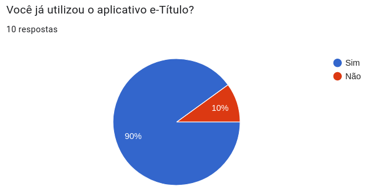
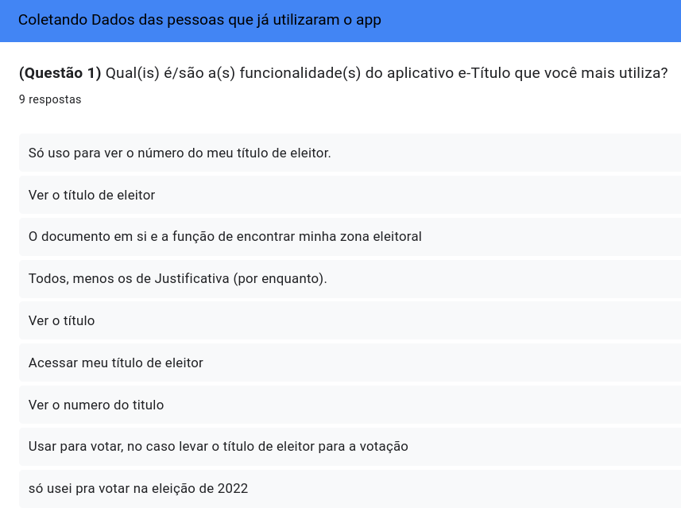
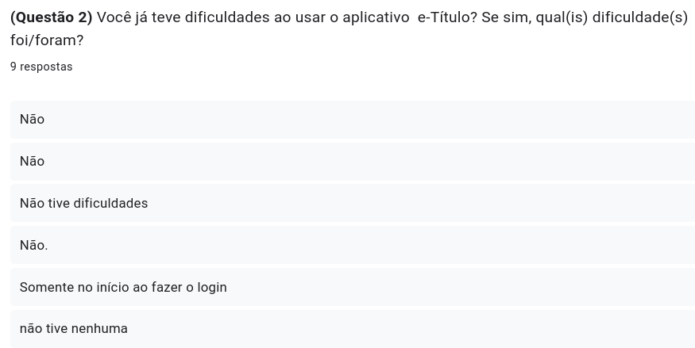
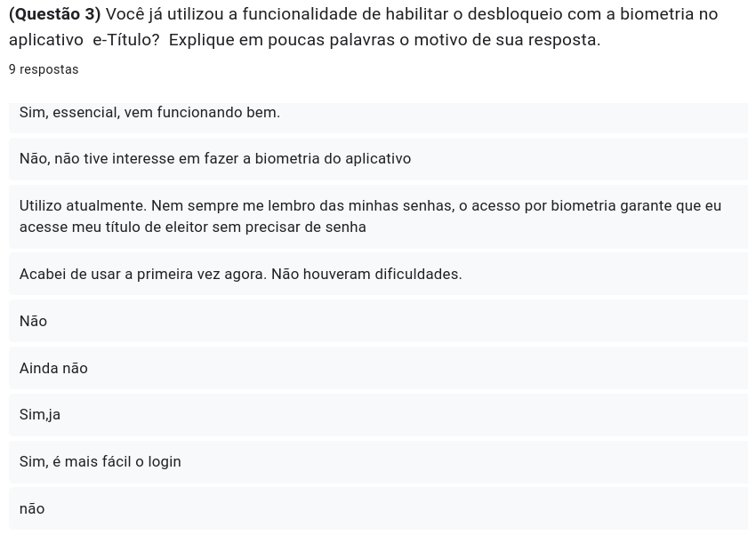
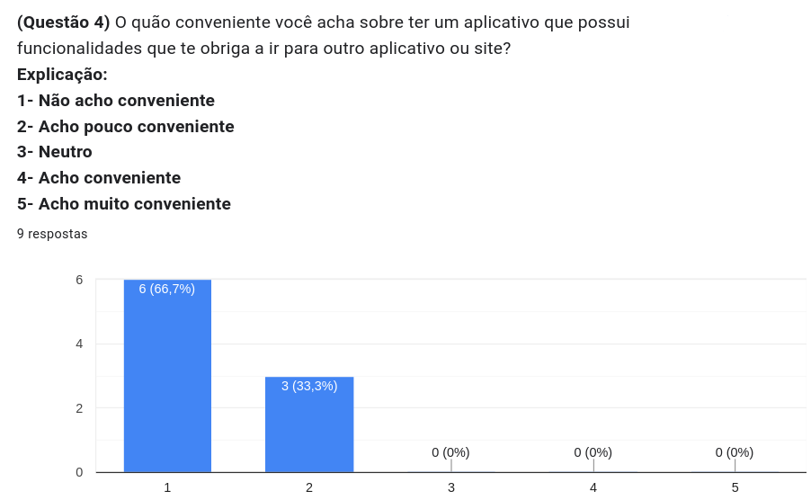
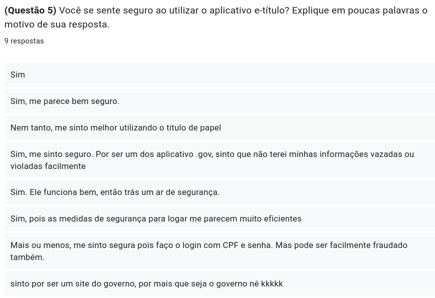
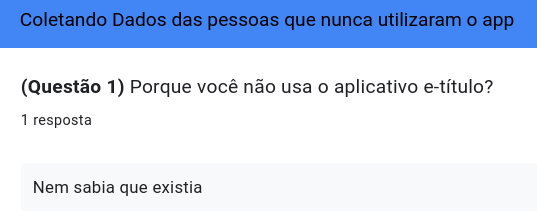
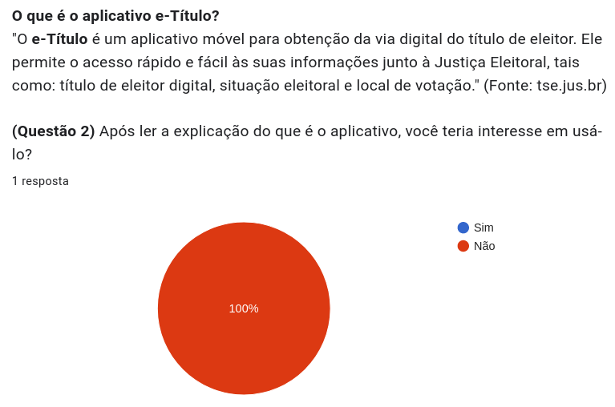
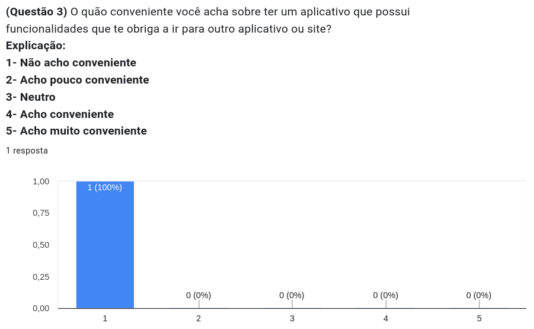

# Questionário

## Introdução

Os questionários emergem como uma ferramenta essencial na fase inicial da elicitação de requisitos, desempenhando o papel de um instrumento simples e eficaz. Compostos por perguntas abertas e/ou fechadas, esses formulários se destacam ao coletar uma ampla gama de requisitos de indivíduos dispersos geograficamente. Além de sua simplicidade, sua natureza econômica os torna particularmente valiosos, visando reunir informações abrangentes de uma extensa população.

## Motivação e objetivo 

A motivação por trás do uso de questionários na elicitação de requisitos reside na necessidade de coletar informações de forma estruturada e eficiente. Os questionários são especialmente úteis quando se deseja obter dados de um grande número de pessoas ou stakeholders de maneira consistente. Além disso, eles podem ser distribuídos de forma a permitir a participação de indivíduos geograficamente dispersos.

O objetivo principal dos questionários na elicitação de requisitos é obter uma visão abrangente das necessidades, expectativas e restrições dos stakeholders envolvidos no projeto. Isso pode incluir usuários finais, clientes, desenvolvedores, entre outros. Através das respostas coletadas, os analistas podem identificar padrões, prioridades e conflitos nos requisitos.

## Metodologia

A metodologia iniciou-se com a contextualização do projeto e a definição clara de seus objetivos, identificando os stakeholders envolvidos para se obter um questionário com o intuitor de conhecer o perfil de usuário do aplicativo e-Titulo. Em seguida, desenvolve-se um questionário estruturado com 2 partes, uma que foi apenas para os que já utilizaram o aplicativo possuindo apenas 5 questões rápidas e simples, e a segunda parte é apenas para os que nunca usaram com apenas 3 questões. A implementação do questionário foi feita por meio online, usando o aplicativo google-forms e foi liberado durante os dias 01/10/2023 até 03/10/2023 e obteve XX respostas durante esse tempo. Os resultados foram analisados, categorizados e interpretados, culminando em um relatório final detalhado. A conclusão do processo envolveu a sumarização dos requisitos identificados e considerações finais, proporcionando uma abordagem abrangente e iterativa para a coleta eficaz de requisitos por meio de questionários.

## Resultados

O questionário obteve 10 pessoas que responderam as questões e apresentava 5 perguntas para os que já usaram o aplicativo e-título, 3 perguntas para os que nunca usaram, ou seja, foi divididas em dois fluxos, a depender da resposta da pergunta da Imagem 1 um de pessoas que nunca utilizaram o aplicativo e outro de quem já o utilizou.

as respostas dos que já utilizaram estão presentes nas imagens de 2 até 6, e as que nunca usaram é da imagem 7 até 9.

Imagem 1 - print da primeira pergunta

Fonte: Autoria Própria, 2023.

### Pessoas que utilizaram o aplicativo

Imagem 2 - print da primeira pergunta para os que usam o aplicativo

Fonte: Autoria Própria, 2023.

Imagem 3 - print da segunda pergunta para os que usam o aplicativo

Fonte: Autoria Própria, 2023.

Imagem 4 - print da terceira pergunta para os que usam o aplicativo

Fonte: Autoria Própria, 2023.

Imagem 5 - print da quarta pergunta para os que usam o aplicativo

Fonte: Autoria Própria, 2023.

Imagem 6 - print da quinta pergunta para os que usam o aplicativo

Fonte: Autoria Própria, 2023.

### Pessoas que nunca utilizaram o aplicativo

Imagem 7 - print da primeira pergunta para os que não usam o aplicativo

Fonte: Autoria Própria, 2023.

Imagem 8 - print da segunda pergunta para os que não usam o aplicativo

Fonte: Autoria Própria, 2023.

Imagem 9 - print da terceira pergunta para os que não usam o aplicativo

Fonte: Autoria Própria, 2023.

## Análise dos resultados

Foi percebido que a maioria das pessoas que responderam já utilizaram o aplicativo, logo os dados coletados são de suma maioria do publico alvo, ou seja as pessoas que estamos mais interessados para a coleta de dados, apenas uma pessoa nunca utilizou, por não saber que existia tal aplicativo e mesmo após ler sobre como é o app, não se interessou em ter. 

A funcionalidade mais utilizada é a visualização dos dados do título eleitoral, e um mencionou que utiliza para verificar a localização da votação. Na funcionalidade da biometria praticamente metade dos participantes já utilizou, o restante não ou não sabia que havia tal função. As dificuldades encontradas foram mínimas, sendo apenas na etapa de fazer o login. As funcionalidades que tem navegaçaõ obrigatoria para o exterior do aplicativo como acesso a outro app ou para o site do TSE, maioria votaram que não acham conveniente.

Na questão da segurança, um pouco mais da petade diz que acham seguro, porém os que não acharam dizia que a etapa de login pode ser facilmente fraudada.

Contudo, é notório que o aplicativo possui aplicações que agradam os usuários mas ah presença de problemas como nas funcionalidades de navegabilidade, no login e na parte de biometria.

## Requisitos Elicitados

As tabelas 1 e 2, são os requisitos obtidos apartir das respostas e análise das perguntas presentes no questionário.

### Legenda

- RFx: Requisito Funcional nºx
- RNFx: Requisito Não-Funcional nºx
- Qx: Requisito funcionais nºx elicitado pelo Questionário
- QNx: Requisito não funcionais nºx elicitado pelo Questionário
- Na coluna de Implementado, informa se o requisito em específico está presente ou não no aplicativo

### Requisitos Funcionais

Tabela 1 - Requisitos Funcionais

|  ID  |  Descrição  | Código | Implementado |  
| ------ | ------- | ---------| --------- |
|  Q1 | O usuário deve poder visualizar a localização do local de votação |  RF1 | Sim |
|  Q2 | O usuário deve poder escolher a forma de realizar o login |  RF2 | Sim |
|  Q3 | O usuário deve poder realizar o login com a biometria |  RF3 | Sim |
|  Q4 | O usuário deve poder realizar o login com o CPF e senha |  RF4 | Sim |
|  Q5 | O usuário deve conseguir visualizar os dados do título eleitoral |  RF5 | Sim |

Fonte: Autoria própria, 2023.

### Requisitos Não-Funcionais

Tabela 2 - Requisitos Não Funcionais

|  ID  |  Descrição  | Código | Implementado |  
| ------ | ------- | ---------| --------- |
| QN1 | O aplicativo deve manter a atualização das informações do local da votação de cada usuário | RNF1 | Sim |
| QN2 | O aplicativo deve trazer a segurança para os usuários com etapas de verificações | RNF2 | Sim |
| QN3 | O aplicativo deve possuir uma navegabilidade que não leve o usuário para fora do app | RNF3 | Não |

Fonte: Autoria própria, 2023.

## Bibliografia

> Guia facetado de técnicas elicitação de requisitos. Disponível em: <https://retraining.inf.ufsc.br/guia/app/classificacoes/tecnicas-de-elicitacao-de-requisitos/entidades/tecnicas-de-elicitacao-de-requisitos-entrevista> Acesso em: 02 de Outubro de 2023. 

## Histórico de Versões

| Versão | Data       | Descrição         | Autor(es)                                                                                     | Revisor(es)                                      |
| ------ | ---------- | ----------------- | --------------------------------------------------------------------------------------------- | ------------------------------------------------ |
| 1.0 | 25/09/2023 | Adicionando estrutura do documento e introdução | [Esther Sena](https://github.com/esmsena) | Mateus Orlando e João Victor Costa |
| 1.1 | 04/10/2023 | Adicionando metodologia e alterando introdução| [Esther Sena](https://github.com/esmsena) | Mateus Orlando e João Victor Costa |
| 1.2 | 04/09/2023 | Adicionando conteúdos nos tópicos Análise dos resultados e Requisitos Elicitados | [Maria Barbosa](https://github.com/Madu01) | Mateus Orlando e João Victor Costa |
| 1.3 | 04/10/2023 | Adicionando motivação e objetivo| [Esther Sena](https://github.com/esmsena) | Mateus Orlando e João Victor Costa |
| 1.4 | 04/09/2023 | Adicionando conteúdos no tópico e subtópicos de Resultados | [Maria Barbosa](https://github.com/Madu01) | Mateus Orlando e João Victor Costa |
