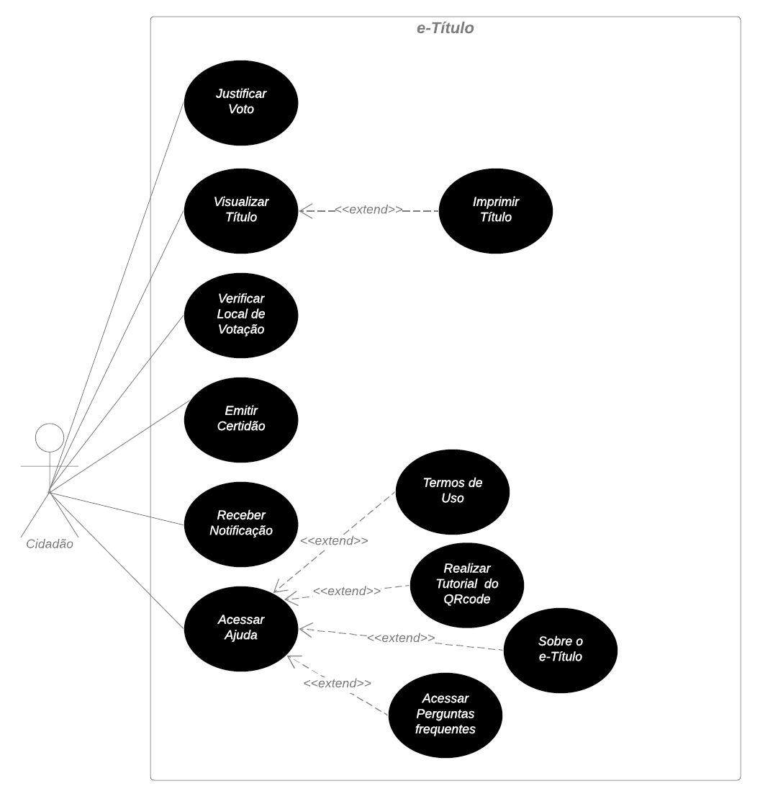

# Casos de Uso

## Conceito

Casos de uso é uma técnica de modelagem de requisitos que descreve as interações entre um sistema e seus atores (usuários, sistemas externos, etc.). Eles ajudam a identificar e documentar as funcionalidades do sistema a partir de uma perspectiva de alto nível. Cada caso de uso descreve um cenário de interação entre o sistema e um ator, representando o que o sistema faz em resposta a ações do ator. Os diagramas de casos de uso são usados para visualizar esses casos de uso e suas relações, fornecendo uma visão geral do sistema e facilitando a comunicação entre os stakeholders. Em resumo, os casos de uso são uma ferramenta eficaz para capturar e comunicar os requisitos funcionais de um sistema de software.

## Metodologia

Como já exposto no tópico de Conceito, um diagrama de caso de uso é uma representação visual que resume as interações entre os usuários(atores) e o sistema, destacando suas funcionalidades e o seu comportamento. Ele é composto por atores, que representam os usuários, e casos de uso, que descrevem as ações realizadas pelos usuários e as respostas do sistema. Para criar um caso de uso, frequentemente se utiliza uma persona, como o [Diego Carvalho](https://requisitos-de-software.github.io/2023.2-e-Titulo/elicitacao/Personas/), para melhor compreender as necessidades e desejos dos usuários finais do sistema. Ao incorporar a persona [Diego Carvalho](https://requisitos-de-software.github.io/2023.2-e-Titulo/elicitacao/Personas/), criada previamente e disponível na documentação de Personas, em um diagrama de caso de uso, é possível modelar cenários realistas de uso do sistema que levam em consideração as diferentes necessidades e objetivos do tipo de usuário que ela representa. Agora, voltando ao tópico sobre os elementos do diagrama de caso de uso, eles podem ser encontrados na Tabela 1.

## Diagrama de Casos de Uso

A figura 1 demonstra o diagrama de casos de uso.

A figura 1 demonstra o diagrama de casos de uso.

|                                                    |
|---------------------------------------------------------------------------------------|

 
Figura 1: Diagrama de Casos de Uso do e-Título.

<b>Fonte: <a href="https://github.com/MateusPy">Mateus Orlando</a></b>

## Legenda

<b>Tabela 1</b>: Legenda do Diagrama de Casos de Uso

| Nome | Função | Elemento
|------|------|:-------:
| Ator | Representam os diferentes tipos de usuários externos que interagem com o sistema | <figure class="usecaseElement" style="width: 30%; display: flex;"></figure>
| Sistema (Retângulo) | Usado para representar o sistema ou o bloco em análise. Ele envolve os casos de uso e atores relacionados | <figure class="usecaseElement" style="width: 30%; display: flex;"></figure>
| Casos de Uso (Elipse) | É usada para representar os casos de uso no diagrama. Um caso de uso descreve uma funcionalidade ou uma ação específica que o sistema pode realizar em resposta às interações dos atores. A elipse contém o nome do caso de uso | <figure class="usecaseElement" style="width: 30%; display: flex;"></figure>
| Relações (Setas) | As flechas são usadas para representar as relações ou interações entre atores e casos de uso | <figure class="usecaseElement" style="width: 30%; display: flex;"></figure>

<b>Fonte: <a href="https://github.com/MateusPy">Mateus Orlando</a></b>

## Casos de Uso

A seguir, as tabelas de 2 a 7 mostram as especificações dos casos de uso.

Tabela 2: Justificar Voto

| UC01 | Informações |
| ----- | ---------- |
| Descrição |  O cidadão é capaz de justificar o seu voto. |
| Ator | Cidadão |
| Pré-condições |<ul><li>Acesso à internet.</li><li>Acesso ao app.</li>|
| Ação | O cidadão  justifica seu voto. | 
| Fluxo principal | <ul><li>O cidadão acessa o aplicativo e-Título e faz login em sua conta. <ul><li>O cidadão navega até barra que fica na parte inferior da tela de início e clica eno botão: Mais opções. <ul><li>O cidadão vai até a seção de justificativa e seleciona justificativa de ausência e reponde a um pequeno formulário para informar a justificativa de sua abstenção. <ul> |
| Fluxo alternativo | <ul><li>O cidadão acessa o aplicativo e-Título e faz login em sua conta. <ul><li>O cidadão navega até barra que fica na parte inferior da tela de início e clica eno botão: Mais opções. <ul><li>O cidadão vai até a seção de justificativa e seleciona justificativa presencial. <ul><li>O cidadão é redirecionado ao site do tse para mais informações. <ul>|
| Fluxo de exceção | - |
| Pós-condições | O cidadão tem a sua abstenção justificada. |
| Data de Criação | 23/10/2023 |
| Rastreabilidade | INT19 |

<b>Fonte: <a href="https://github.com/MateusPy">Mateus Orlando</a></b>

Tabela 3: Visualizar Título

| UC02 | Informações |
| ----- | ---------- |
| Descrição |  O cidadão é capaz de vizualizar o seu título de eleitor. |
| Ator | Cidadão |
| Pré-condições |<ul><li>Acesso à internet.</li><li>Acesso ao app.</li>|
| Ação | O cidadão visualiza o seu título de eleitor. | 
| Fluxo principal | <ul><li>O cidadão acessa o aplicativo e-Título e faz login em sua conta. <ul><li> Ao logar, o cidadão navega até a barra inferior e seleciona o botão: e-Título. <ul> |
| Fluxo alternativo 1 | <ul><li>O cidadão acessa o aplicativo e-Título e faz login em sua conta. <ul><li>O cidadão navega até barra que fica na parte inferior da tela de início e clica eno botão: Mais opções. <ul><li>O cidadão vai até a seção de Outras opções e seleciona a opção de Imprimir Título Eleitoral, gerando um pdf do seu título do eleitor. <ul>|
| Fluxo alternativo 2 | <ul><li>O cidadão acessa o aplicativo e-Título e é redirecionado para o Título Net, caso não tenha o título ainda. <ul><li>O cidadão preenche um formulário e envia os documentos solicitados para emissão do título. <ul><li>Uma vez emitido, o cidadão faz o login no e-Título e é capaz de visualizar o seu título de eleitor na aba: e-Título.  <ul> |
| Fluxo alternativo 3 | <ul><li>O cidadão acessa o aplicativo diretamente o Título Net a partir do site do Tribunal superior Eleitoral(TSE). <ul><li>O cidadão preenche um formulário e envia os documentos solicitados para emissão do título. <ul><li>O cidadão é capaz de acessar o e-Título e vizualizar o seu título de eleitor. <ul>|
| Fluxo de exceção | <ul><li>O cidadão tenta visualizar o título antes da validação do mesmo. <ul><li>O sistema exibe uma notificação informando que é necessário a conclusão do processo de emissão. <ul> |
| Pós-condições | O cidadão tem seu título emitido e pode visualizá-lo através do e-Título. |
| Data de Criação | 23/10/2023 |
| Rastreabilidade | INT5 |

<b>Fonte: <a href="https://github.com/MateusPy">Mateus Orlando</a></b>

Tabela 4: Verificar Local de Votação

| UC03 | Informações |
| ----- | ---------- |
| Descrição |  O cidadão é capaz de visualizar o seu local de votação. |
| Ator | Cidadão |
| Pré-condições |<ul><li>Acesso à internet.</li><li>Acesso ao app.</li><li> Localização ativada no dispositivo.</li>|
| Ação | O usuário visualiza o local onde irá votar. | 
| Fluxo principal | <ul><li>O cidadão acessa o aplicativo e-Título e faz login em sua conta. <ul><li>O usuário navega até barra que fica na parte inferior da tela de início e clica eno botão: Onde Votar. <ul><li>O cidadão tem acesso ao endereço por escrito, além da localização do gps integrado com o e-Título com as melhores rotas até o destino.  <ul> |
| Fluxo alternativo | Não possui. |
| Fluxo de exceção | <ul><li>A localização do aparelho está desligada. <ul><li>O aplicativo exibe uma mensagem informando que é necessário ativar a localização do dispositivo.  |
| Pós-condições | O cidadão sabe onde é o seu local para voto. |
| Data de Criação | 23/10/2023 |
| Rastreabilidade | BS5 |

<b>Fonte: <a href="https://github.com/MateusPy">Mateus Orlando</a></b>

Tabela 5: Emitir Certidão de Quitação Eleitoral

| UC04 | Informações |
| ----- | ---------- |
| Descrição | Usuário é capaz de emitir certidão de quitação. |
| Ator | Cidadão |
| Pré-condições |<ul><li>Acesso à internet</li><li>Acesso ao app</li>|
| Ação | O usuário emite sua certidão de quitação eleitoral. | 
| Fluxo principal | <ul><li>O cidadão acessa o aplicativo e-Título e faz login em sua conta. <ul><li>O cidadão navega até barra que fica na parte inferior direita da tela de início e seleciona o botão: Mais opções. <ul><li>O cidadão vai até a seção de Certidões e seleciona a opção de emitir certidão de quitação onde será  gerada a certidão  no formato pdf.  <ul>|
| Fluxo alternativo 1 | <ul><li>O cidadão acessa o aplicativo e-Título e faz login em sua conta. <ul><li>O cidadão navega até barra que fica na parte inferior direita da tela de início e seleciona o botão: Mais opções. <ul><li>O cidadão vai até a seção de Certidões e seleciona a opção de emitir certidão de: Nada consta criminial eleitoral.  <ul>|
| Fluxo alternativo 2 | <ul><li>O cidadão acessa o aplicativo e-Título e faz login em sua conta. <ul><li>O cidadão navega até barra que fica na parte inferior direita da tela de início e seleciona o botão: Mais opções. <ul><li>O cidadão vai até a seção de Certidões e seleciona a opção de emitir declaração de trabalho eleitoral.  <ul>|
| Fluxo de exceção | - |
| Pós-condições | O cidadão tem sua certidão de quitação emitida. |
| Data de Criação | 21/10/2023 |
| Rastreabilidade | ENT4 |

<b>Fonte: <a href="https://github.com/MateusPy">Mateus Orlando</a></b>

Tabela 6: Receber Notificação

| UC05 | Informações |
| ----- | ---------- |
| Descrição | Usuário é capaz de receber notificações acerca das eleições. |
| Ator | Cidadão |
| Pré-condições |<ul><li>Acesso à internet</li><li>Conta ao app</li> |
| Ação | O usuário recebe notificação. | 
| Fluxo principal | <ul><li>O cidadão acessa o aplicativo e-Título e faz login em sua conta. <ul><li>O cidadão navega até barra que fica na parte inferior direita da tela de início e seleciona o botão: Notificações. <ul><li>O cidadão tem acesso às notificações enviadas pelo e-título no período das eleições acerca de horário, local de votação, dentre outras.  <ul> |
| Fluxo alternativo | Não há. |
| Fluxo de exceção | - |
| Pós-condições | O é informado acerca de informações ligadas às eleições. |
| Data de Criação | 22/10/2023 |
| Rastreabilidade | BS6 |

<b>Fonte: <a href="https://github.com/MateusPy">Mateus Orlando</a></b>

Tabela 7: Acessar Ajuda

| UC06 | Informações |
| ----- | ---------- |
| Descrição | O cidadão é capaz de sanar dúvidas através de 4 opções: Termos de uso, Perguntas frequentes, Tutorial do QRcode e Sobre o e-Título |
| Ator | Cidadão |
| Pré-condições |<ul><li>Acesso à internet</li><li>Acesso ao app</li>|
| Ação | O cidadão sana suas dúvidas | 
| Fluxo principal | <ul><li>O cidadão acessa o aplicativo e-Título e faz login em sua conta. <ul><li>O cidadão navega até barra que fica na parte inferior da tela de início e clica eno botão: Mais opções. <ul><li>O cidadão vai até a seção de Ajuda e seleciona o tipo de ajuda, dentre as opções, que melhor o atenda. <ul> |
| Fluxo alternativo 1 | <ul><li>O cidadão acessa o aplicativo e-Título e faz login em sua conta. <ul><li>O cidadão navega até barra que fica na parte inferior da tela de início e clica eno botão: Mais opções. <ul><li>O cidadão vai até a seção de Ajuda e seleciona a opção de termos de usos, sendo redirecionado ao documento de termos de uso que detalhará algumas questões acerca do aplicativo em questão. <ul>|
| Fluxo alternativo 2 | <ul><li>O cidadão acessa o aplicativo e-Título e faz login em sua conta. <ul><li>O cidadão navega até barra que fica na parte inferior da tela de início e clica eno botão: Mais opções. <ul><li>O cidadão vai até a seção de Ajuda e seleciona a opção de perguntas frequentes, sendo redirecionado à uma lista com as 29 perguntas mais comuns acerca do e-Título. <ul> |
| Fluxo alternativo 3 | <ul><li>O cidadão acessa o aplicativo e-Título e faz login em sua conta. <ul><li>O cidadão navega até barra que fica na parte inferior da tela de início e clica eno botão: Mais opções. <ul><li>O cidadão vai até a seção de Ajuda e seleciona a opção de tutorial do QRcode, sendo redirecionado à uma animação explicativa acerca da utilização do QRcode. <ul> |
| Fluxo alternativo 4 | <ul><li>O cidadão acessa o aplicativo e-Título e faz login em sua conta. <ul><li>O cidadão navega até barra que fica na parte inferior da tela de início e clica eno botão: Mais opções. <ul><li>O cidadão vai até a seção de Ajuda e seleciona a opção de sobre o e-Título, sendo redirecionado a um documento explicativo acerca do e-título. <ul> |
| Fluxo de exceção | - |
| Pós-condições | O usuário terá suas dúvidas sanadas. |
| Data de Criação | 20/05/2023 |
| Rastreabilidade | INT19, BS12, ENTNF1, ENT5, BS4, BS7|

<b>Fonte: <a href="https://github.com/MateusPy">Mateus Orlando</a></b>

## Bibliografia

> Lucidchart. Diagrama de Caso de Uso UML. Disponível em: <<https://www.lucidchart.com/pages/pt/diagrama-de-caso-de-uso-uml>>. Acesso em: 18 out. 2023.

> BARBOSA, S. D. J.; SILVA, B. S. Interação Humano-Computador. Rio de Janeiro: Elsevier, 2011.

> FERNANDO, Sidney. Caso de Uso. Repositório da disciplina de Requisitos de Software da Universidade de Brasília, 2023. Disponível em: [https://requisitos-de-software.github.io/2023.1-BilheteriaDigital/modelagem/useCase/](https://requisitos-de-software.github.io/2023.1-BilheteriaDigital/modelagem/useCase/). Acesso em: 18 out. 2023.

> ALVISSUS, Giovanni. Caso de uso. Repositório da disciplina de Requisitos de Software da Universidade de Brasília, 2022. Disponível em: [https://requisitos-de-software.github.io/2023.1-VLC/#/modelagem/casos_de_uso](https://requisitos-de-software.github.io/2023.1-VLC/#/modelagem/casos_de_uso). Acesso em: 20 out. 2023.

## Histórico de Versões

| Versão | Data       | Descrição                                      | Autor(es)                                        | Revisor(es)                                                       |
| ------ | ---------- | ---------------------------------------------- | ------------------------------------------------ | ----------------------------------------------------------------- |
| 1.0    | 18/10/2023 | Criação da página | [Mateus Orlando](https://github.com/MateusPy)   | [Esther Sena](https://github.com/esmsena) e [Mariiana Siqueira](https://github.com/Maryyscreuza)|
| 1.1    | 21/10/2023 | Hospedagem do Diagrama de Casos de Uso e da legenda | [Mateus Orlando](https://github.com/MateusPy)   | [Esther Sena](https://github.com/esmsena) e [Mariiana Siqueira](https://github.com/Maryyscreuza)|
| 1.2    | 23/10/2023 | Início das especificações dos casos de Uso | [Mateus Orlando](https://github.com/MateusPy)   | [Esther Sena](https://github.com/esmsena) e [Mariiana Siqueira](https://github.com/Maryyscreuza)|
| 1.3    | 23/10/2023 | Finalizando as especificações dos casos de Uso | [Mateus Orlando](https://github.com/MateusPy)   | [Esther Sena](https://github.com/esmsena) e [Mariiana Siqueira](https://github.com/Maryyscreuza)|