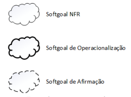
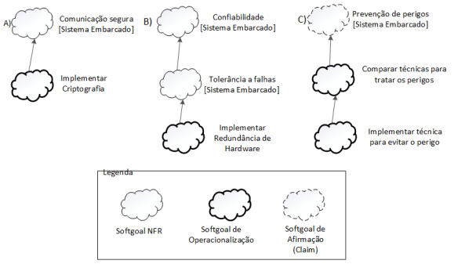
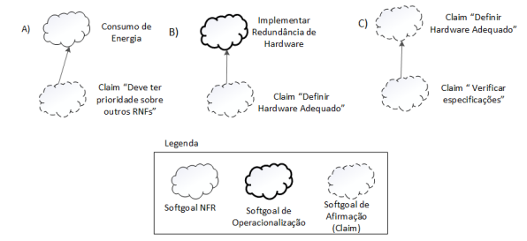

# NFR Framework

## Introdução
   
O NFR Framework é uma estrutura orientada a processos para representar e analisar requisitos não funcionais. Ele fornece diretrizes claras para a identificação, análise e priorização desses requisitos, levando em consideração as características específicas do domínio e do sistema em desenvolvimento. Isso ajuda os desenvolvedores a tomar decisões informadas sobre as alternativas de desenvolvimento, garantindo que as soluções atendam aos requisitos não funcionais de forma eficaz. O NFR Framework também promove a comunicação e colaboração entre as partes interessadas, facilitando a compreensão mútua dos requisitos e metas do sistema.

## Motivação e Objetivo

A utilização do NFR Framework neste projeto é motivada pela necessidade de representar de forma eficaz os Requisitos Não-Funcionais (RNFs). A framework oferece uma solução específica e rica para abordar esses requisitos, permitindo sua representação por meio de um grafo chamado SIG (Softgoal Interdependency Graph). O NFR Framework destaca-se por sua capacidade de expressar não apenas os próprios RNFs, mas também suas relações e correlações de maneira clara e compreensível. Isso facilita a análise e a gestão de RNFs, contribuindo para um entendimento mais profundo de como esses requisitos influenciam o sistema.

Com o uso deste framework, o projeto tem como objetivo melhorar a gestão e a compreensão dos Requisitos Não-Funcionais.

## SIG

O funcionamento do NFR framework pode ser visualizado em termos da construção, elaboração, análise e revisão incremental e interativa de um gráfico de interdependência de softgoal conhecido como "Softgoal Interdependency Graph (SIG)".Este gráfico registra as considerações do desenvolvedor sobre os softgoals e mostra suas interdependências. O registro gráfico das decisões tomadas inclui Requisitos Não-funcionais e suas alternativas, decisões e justificativas associadas às decisões. Sendo possível a realização de um procedimento de avaliação para verificar se os requisitos de nível superior são atendidos.

### Softgoal

O NFR Framework  utiliza o conceito de softgoal, que é um objetivo sem uma definição clara ou critérios precisos de satisfação. Os softgoals são usados para representar Requisitos Não-Funcionais e podem estar inter-relacionados, expressando a influência de um softgoal em outro. O Framework também possui um método de análise qualitativa para determinar o status dos softgoals, levando em consideração se outros softgoals relacionados foram ou não satisfeitos (CHUNG et al., 2000).

#### Tipos de Softgoals

O framework possue três tipos de softgoals Softgoals NFR, Softgoals de Operacionalização e Softgoals
de Afirmação. Abaixo será explicado cada um deles e na figura 1 serão ilustrados esses softgoals.

- *Softgoals NFR* Nuvens claras são utilizadas para representar esse tipo de softgoal. E segundo os autores Chung; Nixon; Yu e Mylopoulos (2000), Softgoals NFR, nada mais é do que, basicamente, os Requisitos Não-Funcionais e podem estar interrelacionados, organizados em catálogos e apresentados de forma hierárquica no desenvolvimento do projeto.

- *Softgoals de Operacionalização* Já este softgoal é representado por nuvens com linhas mais grossas e segundo os mesmos autores citados no tópico acima, softgoals de operacionalização representam soluções de implementação para satisfazer softgoals NFR ou outros softgoals de operacionalização. Essas soluções incluem operações, processos, representações de dados, estruturações e restrições no sistema alvo para atender às necessidades indicadas pelos softgoals NFR e de operacionalização.

- *Softgoals de Afirmação* São usados para apoiar e justificar as decisões de desenvolvimento, levando em consideração as características do domínio, prioridades e carga de trabalho. nuvens com linhas tracejadas que são usadas para representá-lo. Eles servem como justificativa para apoiar ou negar a forma como os softgoals são priorizados, refinados e os componentes são selecionados, facilitando a revisão, a justificativa e a mudança do sistema, bem como o aprimoramento da rastreabilidade.

Figura 1 - Tipos de softgoals

Fonte: SILVA, Reinaldo. 2019.

### Interdependências

Os softgoals estão inter-relacionados por meio de interdependências, tanto na direção descendente quanto ascendente. Na direção descendente, os refinamentos produzem softgoals descendentes a partir de um softgoal pai. Na direção ascendente, os softgoals descendentes contribuem positiva ou negativamente para a realização do softgoal pai.
As interdependências no framework são definidas por meio dos tipos de refinamentos e contribuições.

#### Refinamentos

 Os refinamentos definem uma interdependência hierárquica,ou seja de cima para baixo, na qual um softgoals ascendente (pai) produz um ou mais softgoals descendentes (filhos) e esses softgoals se relacionam com o softgoal ascendente. Os refinamentos são classificados em decomposição, operacionalização e afirmação. Abaixo será explicado os três tipos de refinamentos utilizados pelo NFR Framework e nas figuras 2,3 e 4 ilustrados esses refinamentos.

 As decomposições têm o objetivo de refinar softgoals para obter softgoals mais especializados e estes possam auxiliar na construção do projeto (SILVA,2019). Os quatro tipos de decomposições utilizadas pelo NFR Framework são Decomposição de Softgoal NFR, Decomposição de Operacionalização, Decomposição de Afirmação (Claims) e Priorização.

 - *Decomposição de Softgoal NFR* envolve a subdivisão de um softgoals NFR em outros mais específicos, o que ajuda a lidar com problemas maiores e prioridades, além de enfrentar ambiguidades.

 - *Decomposição de Operacionalização* é a subdivisão de um softgoal de operacionalização em softgoals mais específicos, o que permite definir uma solução geral e refiná-la em soluções mais detalhadas.

 - *Decomposição de Afirmação (Claims)* refinamento de um softgoal de afirmação em outros softgoals de afirmação, o que é importante para apoiar ou negar justificativas específicas de projeto.

 - *Priorização* é uma forma especial de decomposição em que um softgoal é refinado em outro softgoal do mesmo tipo e tópico, mas com uma prioridade associada. Isso permite estabelecer a importância relativa dos softgoals na tomada de decisões.

Figura 2 - Tipos de decomposições

Fonte: SILVA, Reinaldo. 2019.

As operacionalizações são técnicas de desenvolvimento que transformam os softgoals NFR em softgoals de operacionalização, visando alcançar os objetivos desejados. A figura 3 mostra algumas possíveis formas de operalizações de softgoals.

Figura 3 - Operalizações

Fonte: SILVA, Reinaldo. 2019.

As afirmações refinam os softgoals de afirmação em outros softgoals de afirmação (Claim). Isso é útil para apoiar ou negar motivos específicos de projeto(SILVA,2019). A figura 4 mostra algumas possíveis formas de afirmações.

Figura 4 - Afirmações

Fonte: SILVA, Reinaldo. 2019.

#### Contribuições

No NFR framework, são usados vários tipos de contribuições para descrever como a satisfação de um softgoal descendente (filho) afeta a satisfação do softgoal ascendente (pai). Esses tipos são demonstrados na Tabela 1.

Tabela 1 - Tipos de contribuições

| **Tipo de contribuição** | **Notação da contribuição** | **Descrição** |
| ------------------------ | --------- | ------- |
| AND | **AND** | Se todos os softgoals filhos forem satisfeitos, o softgoal pai será satisfeito.| 
| OR | **OR** | Se pelo menos um softgoal filho for satisfeito, o pai também será satisfeito.| 
| MAKE | **++** | Fornece uma contribuição suficientemente positiva, garantindo que, se o softgoal filho for satisfeito, o pai também será.| 
| BREAK | **- -** | Fornece uma contribuição suficientemente negativa, indicando que, se o softgoal filho for suficientemente satisfeito, o pai será negado. | 
| HELP | **+** | Fornece uma contribuição parcialmente positiva, o que significa que, se o softgoal filho for parcialmente satisfeito, o pai será parcialmente satisfeito. | 
| HURT | **-** | Fornece uma contribuição parcialmente negativa, indicando que, se o softgoal filho for satisfeito, o pai será parcialmente negado. |
| UNKNOWN | **?** | Fornece uma contribuição desconhecida, podendo ser tanto positiva quanto negativa. |
| EQUALS | **EQUALS** | O softgoal filho só será satisfeito se o pai for satisfeito, e será negado se o pai for negado. |
| SOME + | **SOME +** | Usado quando há incerteza entre HELP ou MAKE. |
| SOME - | **SOME -** | Usado quando não há certeza entre HURT ou BREAK. |

Fonte: Maria Eduarda Barbosa. 2023.

### Procedimento de avaliação

O procedimento de avaliação determina o grau de satisfação dos requisitos não funcionais por meio de decisões, atribuindo rótulos aos softgoals no SIG, os rótulos estão representados na Figura 5. Essa análise parte dos softgoals de nível mais baixo, onde são tomadas decisões sobre a aceitação ou rejeição de alternativas no projeto. Essas decisões geram rótulos iniciais que são utilizados pelo procedimento de avaliação para determinar o impacto das decisões nos softgoals de nível mais alto na hierarquia do SIG, até chegar aos softgoals no nível mais alto.

Figura 5 - Tipos de rótulos.

Fonte: SILVA, Reinaldo. 2019.

#### Explicação dos rótulos:

- **Satisfeito:** Significa que um requisito não funcional contribui positivamente para a realização de outro requisito, resultando em satisfação.
- **Fracamente Satisfeito:** Denota uma relação de impacto positiva, porém menos forte do que o rótulo satisfeito.
- **Negado:** indica que um requisito não funcional afeta de forma discordante a outro requisito, contrariando ou contradizendo sua realização.
- **Fracamente Negado:** Nesse, representa a forma menos intensa do rótulo negado.
- **Conflitante:** Mostra uma relação de conflito entre requisitos não funcionais, sugerindo que esses requisitos têm características tanto positivas quanto negativas.
- **Indeterminado:** Significa uma relação desconhecida entre requisitos não funcionais, quando não se dispõe de dados suficientes para avaliar o impacto de um requisito sobre outro.

## Cartão de especificação
Os cartões de especificação, também conhecidos como "snowcards," desenvolvidos por James Robertson e Suzanne Robertson, são uma ferramenta utilizada na engenharia de requisitos e na metodologia de desenvolvimento de sistemas. Esses cartões são usados para capturar e organizar informações relacionadas aos requisitos de um sistema ou projeto.

No caso deste projeto será utilizado o modelo adaptado desses cartões desenvolvido por Reinaldo Silva com o objetivo de representar os Requisitos Não-Funcionais utilizados na construção dos NFR Frameworks, esse modelo se encontra na tabela 2. 

Tabela 2 - Exemplo de modelo do Cartão de especificação 

| **Nº Requisito: X** (id_Requisito)    **Classificação:** Nome do(s) softgoal(s)| |
| ------------------------ | --------- |
| **Descrição:** | descrição do requisito |
| **Justificativa:** | justificativa da criação do requisito |
| **Origem:** | Origem do requisito |
| **Critério de aceitação:** | métrica do requisito que possa ser testada e satisfeita |
| **Dependência:** | Requisitos relacionados ao especificado |
| **Prioridade:** | É um número que decide o nível de importância do requisito em relaçaõ aos outros |
| **Conflitos:** | Requisitos conflitantes ao requisito especificado |
| **História:** | Data da criação e de modificações |

Fonte: Adaptado de (ROBERTSON; ROBERTSON, 2012).

## Metodologia

Inicialmente foram selecionados os requisitos não funcionais já elicitados para que os softgoals principais sejam definidos, esses foram utilizados no NFR00 - Geral, e logo após foram criados os NFRs com base no geral, além dos impactos deles e no final de cada NFR foram criados os Cartões de especificação. No desenvolvimento dos NFRs envolveu a criação do gráfico de interdependência de softgoal conhecido como "Softgoal Interdependency Graph (SIG)" por meio da ferramenta Draw.io.

## NFR Definidas

### NFR00 - Geral
(onde vai conter todos)
  
### NFRXX - nome
#### Sem impactos propagados
#### Com impactos propagados
#### Cartões de especificação

## Requisitos Não-Funcionais
(os que foram elicitados e utilizados)

## Bibliografia

> 2023.1-Simplenote. GitHub. Disponível em https//requisitos-de-software.github.io/2023.1-Simplenote/modelagem/agil/nfr/. Acesso em 1 de novembro de 2023.  

> 2023.1-BilheteriaDigital. GitHub. Disponível em https//requisitos-de-software.github.io/2023.1-BilheteriaDigital/modelagem/agil/nfrframework/. Acesso em 1 de novembro de 2023.  

## Referencia

conjunto de obras citadas. Deve ser inserida em cada citação e, no final do trabalho, deve fazer parte da bibliografia. "Nem todos tem que ter"

> Referencia_1

> Referencia_2

## Histórico de Versões

| Versão |     Data    | Descrição   | Autor(es) | Revisor(es) |
| ------ | ----------- | ----------- | --------- | ----------- |
| `0.1`  | 03/11/2023  | adição do esqueleto do artefato | [Maria Barbosa](https//github.com/Madu01) | [João Victor](https//github.com/jvcostta) e [Mateus Orlando](https//github.com/MateusPy) |
| `0.2`  | 04/11/2023  | adição do conteúdo no tópico Motivação e Objetivo e melhoramento do esqueleto do artefato | [Maria Barbosa](https//github.com/Madu01) | [João Victor](https//github.com/jvcostta) e [Mateus Orlando](https//github.com/MateusPy) |
| `0.3`  | 05/11/2023  | adição da introdução e do SIG | [Maria Marques ](https//github.com/EduardaSMarques) | [João Victor](https//github.com/jvcostta) e [Mateus Orlando](https//github.com/MateusPy) |
| `0.4`  | 06/11/2023  | acrescentando outros tópicos do SIG até refinamentos | [Maria Marques ](https//github.com/EduardaSMarques) | [João Victor](https//github.com/jvcostta) e [Mateus Orlando](https//github.com/MateusPy) |
| `0.5`  | 06/11/2023  | Adicionando conteúdos nos tópicos Contribuições, Procedimento de avaliação, Cartão de especificação e Metodologia e atualização no tópico NFR Definidas | [Maria Barbosa](https//github.com/Madu01) | [João Victor](https//github.com/jvcostta) e [Mateus Orlando](https//github.com/MateusPy) |
