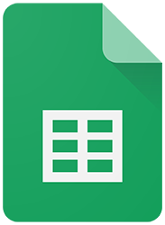

# Ferramentas Utilizadas

## Introdução

A seguir,na Tabela 1, está a lista de ferramentas que o grupo, de maneira consensual, decidiu utilizar, de modo a facilitar o desenvolvimento dos objetivos do projeto da disciplina de Requisitos de Software.

## Motivação e Objetivo

Os objetivos e motivações que levaram à utilização de ferramentas no desenvolvimento do projeto, foi visando otimizar o processo, melhorar a qualidade do trabalho, aumentar a colaboração, facilitar a comunicação e permitir uma gestão mais eficaz, resultando em um projeto bem-sucedido e eficiente.

## Ferramentas

|                                                                                                                      Logo      |        Ferramenta         |                             Finalidade                               |
| :-----------------------------------------------------------------------------------------------------------------------: | :-----------------------: | :--------------------------------------------------------------------: |
|                                   |          GitHub           | Organizar e armazenar os artefatos produzidos para o projeto ao longo do semestre. |
|                             |           Teams           |         Realização de reuniões e gravação das entregas.          |
|                                  |         WhatsApp          |             Utilizado para a comunicação entre os integrantes do grupo.             |
|                        |    Visual Studio Code     |                  Criação dos arquivos de documentação.                  |
|                                                                        |          MkDocs           |                  Criação das páginas de documentação.                  |
|                                 |          YouTube          |                    Hospedagem das reuniões e entregas da disciplina.                    |
|                          |     Google Planilhas      |      Criação de planilhas de planejamento como heatmap.       |

<b>Tabela 1</b> - Ferramentas Utilizadas no Projeto
  
Fonte: Autores.

## Bibliografia

> <a id="FRM1" href="#anchor_1">1.</a> GitHub. Disponível em: [https://docs.github.com/pt](). Acessado em: 18 de set. de 2023.
>
> <a id="FRM2" href="#anchor_2">2.</a> Microsoft Teams. Disponível em: [https://www.microsoft.com/pt-br/microsoft-teams/group-chat-software](). Acessado em: 18 de set. de 2023.
>
> <a id="FRM3" href="#anchor_3">3.</a> Figma. Disponível em: [https://www.figma.com/](). Acessado em: 18 de set. de 2023.
>
> <a id="FRM4" href="#anchor_4">4.</a> MkDocs. Disponível em: [https://www.mkdocs.org/](). Acessado em: 18 de set. de 2023.
>
> <a id="FRM5" href="#anchor_5">5.</a> Visual Studio Code. Disponível em: [https://code.visualstudio.com/](). Acessado em: 18 de set. de 2023.
>
> <a id="FRM6" href="#anchor_6">6.</a> WhatsApp. Disponível em: [https://www.whatsapp.com/?lang=pt_br](). Acessado em: 18 de set. de 2023.
>
> <a id="FRM7" href="#anchor_7">7.</a> YouTube. Disponível em: [https://about.youtube/](). Acessado em: 18 de set. de 2023.
>
> <a id="FRM8" href="#anchor_8">8.</a> Google Planilhas. Disponível em: [https://www.google.com/intl/pt-BR/sheets/about/](). Acessado em: 18 de set. de 2023.
>

## Histórico de Versões

| Versão  |    Data    |                        Descrição                        |                                             Autor(es)                                             |                  Revisor(es)                   |
| :-----: | :--------: | :-----------------------------------------------------: | :-----------------------------------------------------------------------------------------------: | :--------------------------------------------: |
|  `1.0`  | 18/09/2023 |            Criação da página de ferramentas.            | [Mateus Orlando](https://github.com/MateusPy) | [Maria Marques](https://github.com/EduardaSMarques) |
