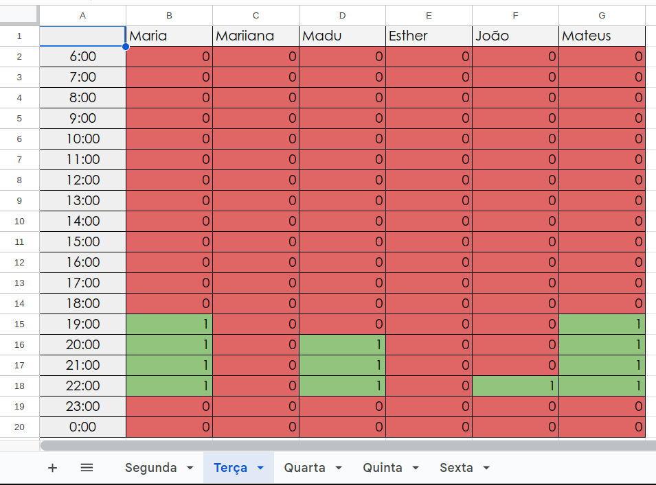
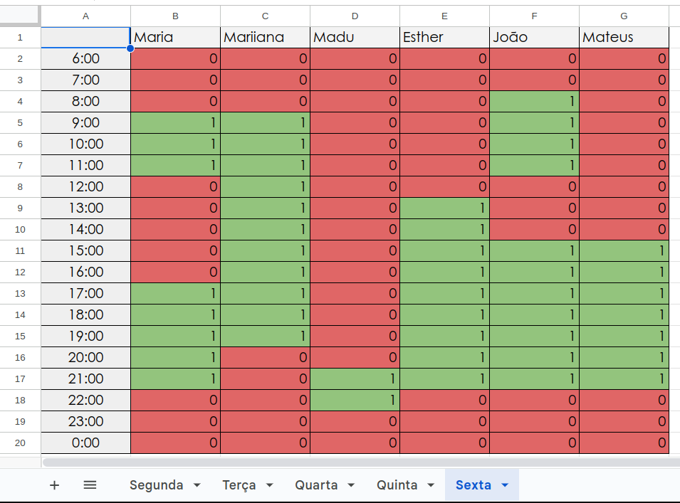

# Introdução
Um heatmap é um gráfico que usa cores para mostrar a intensidade e distribuição de valores em uma matriz. Cores variam de acordo com os valores, ajudando a identificar padrões facilmente em dados. É amplamente usado em análise de dados, geografia, web e medicina para visualização rápida de informações.

# HeatMap Segunda-feira

Imagem 1: HeatMap_Segunda-Feira (Fonte: SENA, Esther 2023).

---

# HeatMap Terça-feira

Imagem 2: HeatMap_Terça-Feira (Fonte: SENA, Esther 2023).

---

# HeatMap Quarta-feira

Imagem 3: HeatMap_Quarta-Feira (Fonte: SENA, Esther 2023).

---

# HeatMap Quinta-feira

Imagem 4: HeatMap_Quinta-Feira (Fonte: SENA, Esther 2023).

---

# HeatMap Sexta-feira

Imagem 5: HeatMap_Sexta-Feira (Fonte: SENA, Esther 2023).

# Bibliografia
* GuiaDoExcel. “Gráfico Head Map / Gráfico de Calor / Planilha Gráfico de calor Heat map [download grátis]”. Disponível em: [GuiaDoExcel](https://www.guiadoexcel.com.br/grafico-heat-map-grafico-de-calor-no-excel/)  Acesso em: 30 agosto, 2023.
* SENA, Esther. "HeatMap da Equipe de REQUISITOS". Disponível em: [link de acesso a panilha](https://www.google.com/intl/pt-BR/sheets/about/)

# Histórico de versões
| Versão | Data       | Descrição                   | Autor(es)     | Revisor(es) |
|--------|------------|-----------------------------|---------------|-------------|
| 1.0    | 18/09/2023 | Criação do HeatMap | [Esther Sena](https://github.com/esmsena) | [João Victor](https://github.com/jvcostta) |
