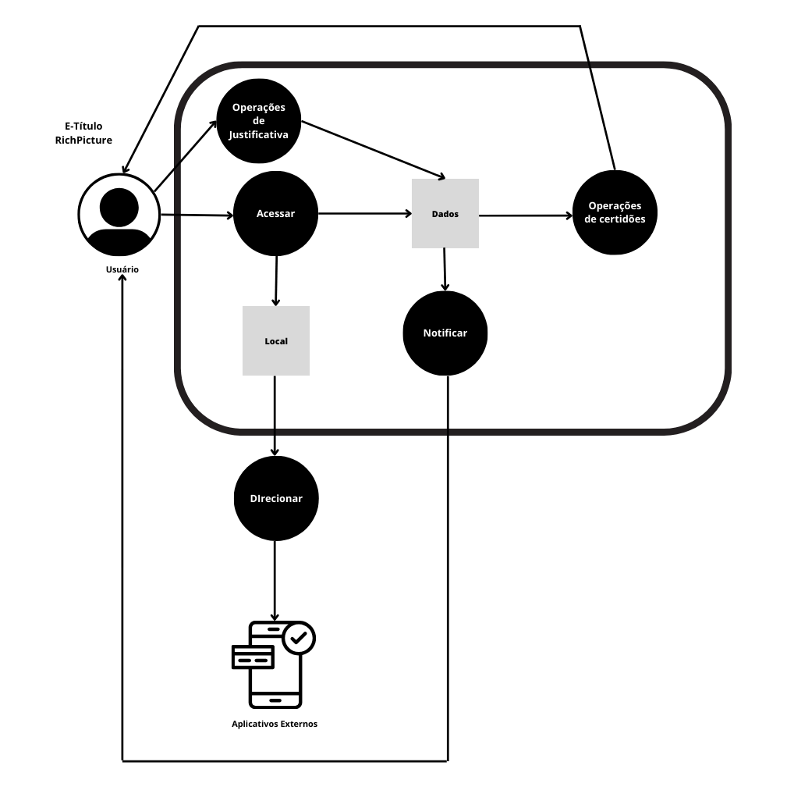

# Rich Picture

## Introdução

O e-Título é um aplicativo para obtenção da via digital do título de eleitor. Ele permite o acesso rápido e fácil às suas informações junto à Justiça Eleitoral, tais como: título de eleitor digital, situação eleitoral e local de votação.

## Objetivo

O rich picture uma ferramenta para analisar problemas e expressar ideias. As rich pictures podem ajudar a identificar processos de negócios e seus requisitos de dados, os atores envolvidos nos processos e suas responsabilidades, as relações entre processos e atores e potenciais problemas e conflitos. <a id=anchor_1 href="#REF1">[1]</a>

## Metodologia 

Para a criação do nosso rich picture, nos reunimos após a aula e fizemos um esboço à mão, analisando o aplicativo e assim decidindo cada ator, operação, dados, fluxo e onde seria o limite do sistema. Após isso, foi montado o rich picture utilizando a ferramenta [Canva](https://www.canva.com/) igual ao esboço inicial.

## RichPicture

Abaixo, na imagem 1, está o rich picture desenvolvido no Canva.

Imagem 1: Rich Picture 

Fonte: SIQUEIRA, Mariiana. 2023.

## Legenda

Para melhor entendimento, na tabela 1 está a legenda do rich picture.

Tabela 1: Legenda do Rich Picture

|Ícones | Componentes | Comentários     |
|-------|-------------|-----------------|
|  | Ator | O usuário do sistema. |
|  | Ator | Aplicativos externos. |
|  | Operações  | Especificam o que o sistema faz.  |
| | Dados | O armazenamento de dados do sistema. |
| | Fluxo | A direção do fluxo de dados (ou informações) do sistema. |
| | Limite | O sistema deve realizar tudo o que está dentro do limite do sistema e você pode ignorar o que está lá fora. |

Fonte: SIQUEIRA, Mariiana. 2023.

## Bibliografia

> BARROS, André. “Rich Picture”. Youtube, 15 fev de 2021. Disponível em: https://www.youtube.com/watchv=NxEPxW_Ku8M. Acesso em: 17 set, 2023.

## Referências

> <a id="REF1" href="#anchor_1">[1]</a> CTEC2402. “Introducing Rich Pictures”. Disponível em: https://aprender3.unb.br/pluginfile.php/2692745/mod_resource/content/2/1_5145791542719414573.pdf. Acesso em: 17 set, 2023.

## Histórico de versões

| Versão | Data       | Descrição                          | Autor(es)     | Revisor(es) |
|--------|------------|------------------------------------|---------------|-------------|
| 1.0    | 18/09/2023 | Criação do RichPicture             | [Mariiana Siqueira Neris](https://github.com/Maryyscreuza) | [Maria Eduarda Barbosa Santos](https://github.com/Madu01) |
| 1.1    | 29/09/2023 | Adição de metodologia e ferramenta | [Mariiana Siqueira Neris](https://github.com/Maryyscreuza) | [Esther Sena Martins](https://github.com/esmsena) |
| 1.2    | 30/11/2023 | Correção pós inspeção | [Mariiana Siqueira Neris](https://github.com/Maryyscreuza) | [Maria Eduarda Barbosa Santos](https://github.com/Madu01)  |
| 1.3    | 05/12/2023 | Correção fonte | [Mariiana Siqueira Neris](https://github.com/Maryyscreuza) | [Maria Eduarda Barbosa Santos](https://github.com/Madu01)  |