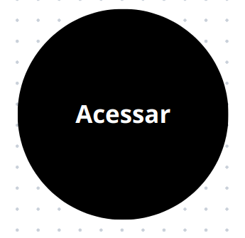
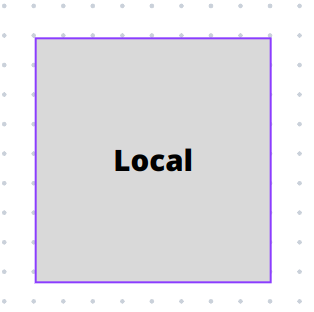
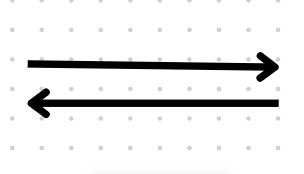

# Introdução
O e-título é um aplicativo para obtenção da via digital do título de eleitor. Ele permite o acesso rápido e fácil às suas informações junto à Justiça Eleitoral, tais como: título de eleitor digital, situação eleitoral e local de votação.

# RichPicture

Imagem 1: Rich Picture (Fonte: NERIS, Mariiana. 2023).

# Legenda
|Ícones | Componentes | Comentários     |
|-------|-------------|-----------------|
|  | Ator      | O usuário do sistema. |
|  | Ator      | Aplicativos externos |
|  | Operações      | Especificam o que o sistema faz. Cada operação é executada por um ator ou por outra operação. |
| | Dados      | Os armazenamentos de dados são essencialmente as tabelas do seu banco de dados ou arquivos do sistema. Também é necessário mostrar o tipo de dados que contêm. |
| | Fluxo     | SAs setas mostram a direção do fluxo de dados (ou informações) entre atores, armazenamentos de dados e operações. As setas podem cruzar os limites do sistema. |
| | Limite      | O limite do sistema identifica as operações pelas quais você é responsável (ou seja, sua área de responsabilidade), o que significa que seu sistema deve realizar tudo o que está dentro do limite do sistema e você pode ignorar o que está lá fora. |

Tabela 1: Legenda do Rich Picture(Fonte: NERIS, Mariiana. 2023).

# Referências Bibliográficas
* CTEC2402. “Introducing Rich Pictures”. Disponível em: https://aprender3.unb.br/pluginfile.php/2692745/mod_resource/content/2/1_5145791542719414573.pdf. Acesso em: 17 set, 2023.
* BARROS, André. “Rich Picture”. Youtube, 15 fev de 2021. Disponível em: https://www.youtube.com/watch?v=NxEPxW_Ku8M. Acesso em: 17 set, 2023.

# Histórico de versões
| Versão | Data       | Descrição                   | Autor(es)     | Revisor(es) |
|--------|------------|-----------------------------|---------------|-------------|
| 1.0    | 18/09/2023 | Criação do RichPicture | [Mariiana Siqueira Neris](https://github.com/Maryyscreuza) | [Maria Eduarda Barbosa Santos](https://github.com/Madu01) |
