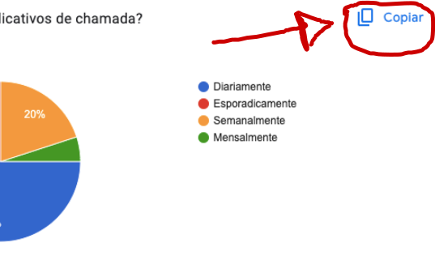

# Verificação do Perfil do Usuário do Grupo 5

## Introdução

Este artefato verifica o perfil dos usuários realizado pelo grupo 5 apresentando um Checklist da Verificação do [Perfil do Usuário](https://requisitos-de-software.github.io/2023.2-Jitsi/Elicitacao/perfilDoUsuario/questionario/) indicando sugestões e melhorias. 

## Metodologia

A metodologia escolhida para realizar a verificação é a de Inspeção do Fagan. Este método é importante para garantir que os artefatos produzidos estejam alinhados com os requisitos e expectativas, contribuindo para a entrega de um produto final mais confiável e eficaz. 

Neste atefato é demonstrado o checklist da etapa de Inspeção do Fagan. Que consiste em uma tabela simples de itens a serem verificados, marcados ou concluídos. Ele serve como uma ferramenta prática para garantir que todas as etapas necessárias tenham sido realizadas, ajudando na organização e na prevenção de erros.

### Checklist da Verificação do Perfil do Usuário

O Checklist segue o modelo especificado em Planejamento da Verificação da Etapa 2 do Grupo 5. O Checklist está presente na Tabela 1.

**Tabela 1** - Checklist para os Itens do Perfil do Usuário.

| ID | Descrição | Avaliação | Observações |
| ---| -------- | --------- | ------------ |
| G1  | O artefato possui Introdução? | Sim | -- |
| G2  | O artefato possui Objetivo? | Não | -- |
| G3  | O artefato possui uma metodologia definida? | Sim | -- |
| G4  | O artefato contém bibliográfia/referência seguindo as normas da ABNT? | Sim | -- |
| G5  | O artefato possui o histórico de versões contendo a Versão, Data, Descrição, Autor(es) e Revisor(es)? | Sim | -- |
| G6  | As imagens/Figuras/vídeos/tabelas estão na norma ABNT no artefato, com legendas e fontes? (isso no caso do artefato possuir tais elementos) | Sim | -- |
| G7  | As imagens/Figuras/vídeos/tabelas estão padronizados sendo chamados com a norma ABNT nos textos do artefato? (isso no caso do artefato possuir tais elementos) | Sim | -- |
| PU1 | O artefato demonstra os resultados por meio de gráficos/figuras/tabelas? | Sim | -- |
| PU2 | O artefato explica os resultados? | Sim | -- |
| PU3 | O artefato possui a definição do usuário? | Sim | -- |
| PU4 | O artefato informa as características do usuário (como faixa etária, gênero, grau de escolaridade, entre outros)? | Sim | -- |
| PU5 | O artefato apresenta as ferramentas utilizadas para a realização do Perfil do Usuário? | Incompleto | Faltou informar a ferramenta utilizada para a criação do questionário |
| PU6 | O artefato informa a quantidade de respostas obtidas para a realização dos resultados? | Sim | -- |

Fonte: Maria Barbosa, 2023.

## Sugestões e melhorias

No geral a qualidade do artefato está ótima. A sugestões para melhorias estão logo abaixo:

- É interessante informar o objetivo do arteato para que o leitor entenda o motivo da criação do artefato. 
- Seria legal retirarem o símbolo do copiar presentes nos prints com os gráficos, mais especificamente nas figuras 1, 2, 3, 4, 7, 8 e 9 do artefato Perfil do usuário. Na Figura 1 demonstra como é o símbolo mencionado, sendo destacado com um círculo vermelho.

**Figura 1** - Demonstração do símbolo copiar.

Fonte: Maria Barbosa, 2023.

## Bibliografia

> 2023.1-BilheteriaDigital. GitHub. Disponível em: https//requisitos-de-software.github.io/2023.1-BilheteriaDigital/modelagem/agil/nfrframework/. Acesso em: 10 de novembro de 2023.

> 2023.2-Jitsi. GitHub. Disponível em: https://requisitos-de-software.github.io/2023.2-Jitsi/. Acesso em: 10 de novembro de 2023.

> SERRANO, Milene. Requisitos – Aula 23. Disponivél em: https://aprender3.unb.br/pluginfile.php/2692856/mod_resource/content/2/Requisitos%20-%20Aula%20023.pdf. Acesso em: 10 de novembro de 2023.

## Histórico de Versões

| Versão | Data       | Descrição   | Autor(es)   | Revisor(es) |
| ------ | ---------- | ----------- | ------------ | ---------- |
| `1.0`  | 10/11/2023 | Criação do documento e Adição do conteúdo nos tópicos introdução, metodologia e Checklist Verificação da Apresentação.  | [Maria Barbosa](https://github.com/Madu01) | [João Victor](https://github.com/jvcostta) |
| `2.0`  | 10/11/2023 | Criação do conteúdo Checklist e das sugestões e melhorias  | [Maria Barbosa](https://github.com/Madu01) | [João Victor](https://github.com/jvcostta) |