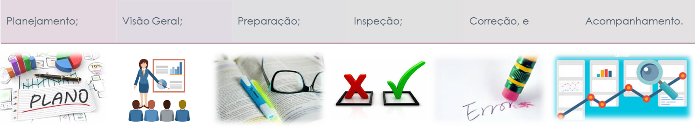

# Planejamento da Verificação da Etapa 1 do Grupo 4

## Introdução

A verificação representa uma das fases fundamentais no progresso de um projeto. Nessa fase, os artefatos (Documentos) gerados durante o projeto passam por uma análise minuciosa para assegurar a conformidade com as exigências estipuladas. Dessa forma, este artefato define a estratégia de verificação aplicada aos artefatos realizados pelo [Grupo 4 - e-título](https://github.com/Requisitos-de-Software/2023.2-e-Titulo) durante a etapa 1.

## Motivação e Objetivo

A verificação dos artefatos no projeto é motivada por garantir a conformidade rigorosa com as exigências estipuladas, assegurando que os documentos produzidos atendam às expectativas. O objetivo de realizar a verificação é identificar e corrigir erros, imprecisões e inconsistências, promovendo a precisão e qualidade do produto final. 

## Metodologia

A metodologia escolhida para realizar a verificação é a de Inspeção do Fagan por ser uma maneira organizada e colaborativa de revisar documentos, promovendo a detecção de problemas. Este método é importante para garantir que os artefatos produzidos estejam alinhados com os requisitos e expectativas, contribuindo para a entrega de um produto final mais confiável e eficaz. 

As etapas da metodologia de Inspeção proposto por fagan estão representadas na Figura 1, vale ressaltar que neste projeto iremos utilizar até a etapa das correções. Na etapa de inspeção será utilizado um checklist. O checklist é uma lista simples de itens ou tarefas a serem verificados, marcados ou concluídos. Ele serve como uma ferramenta prática para garantir que todas as etapas necessárias tenham sido realizadas, ajudando na organização e na prevenção de erros.

**Figura 1** - Etapas da Inspeção de acordo com o Fagan.

Fonte: SERRANO; SERRANO.

### Participantes

Os participantes desta verificação da etapa 1 são:

- [Maria Eduarda Barbosa](https://github.com/Madu01)
- [Maria Eduarda Marques](https://github.com/EduardaSMarques) 
- [Mateus Orlando](https://github.com/MateusPy)
- [João Victor](https://github.com/jvcostta)

### Objetos de Verificação

Os artefatos dessa verificação são:

- [Apresentação](https://requisitos-de-software.github.io/2023.2-e-Titulo/apresentacoes/apresentacao01/)
- [Escolha do Aplicativo](https://requisitos-de-software.github.io/2023.2-e-Titulo/planejamento/aplicativoescolhido/)
- [Cronograma](https://requisitos-de-software.github.io/2023.2-e-Titulo/planejamento/cronogramaPlanejado/)
- [Metodologia](https://requisitos-de-software.github.io/2023.2-e-Titulo/planejamento/metodologia/)
- [Ferramentas](https://requisitos-de-software.github.io/2023.2-e-Titulo/planejamento/Ferramentas/)
- [Rich Picture](https://requisitos-de-software.github.io/2023.2-e-Titulo/planejamento/richpicture/)

**Obs.:** No artefato de Apresentação, está incluido todas as apresentações independente da etapa que foi realizado.

### Cronograma

A verificação será realizada apartir o dia 21 de novembro de 2023 até dia 25 de novembro de de 2023, com os resultados dos checklist de cada artefato da etapa. A seguinte tabela 1, demonstra o cronograma das atividades. 

**Tabela 1** - Cronograma das Atividades.

| Data  do início    | Data do Fim | Data da Revisão | Descrição | Responsável   | 
| ------------------ | ----------- | --------------- | --------- | ------------- |
| 21/11/2023 | 25/11/2023 | 26/11/2023 |  Verificação das Apresentações.  | [Mateus Orlando](https://github.com/MateusPy) |
| 21/11/2023 | 25/11/2023 | 26/11/2023 |  Verificação da Escolha do Aplicativo. | [Maria Eduarda Marques](https://github.com/EduardaSMarques) |
| 21/11/2023 | 25/11/2023 | 26/11/2023 |  Verificação do Cronograma. | [Maria Eduarda Barbosa](https://github.com/Madu01) |
| 21/11/2023 | 25/11/2023 | 26/11/2023 |  Verificação da Metodologia. | [João Victor](https://github.com/jvcostta) |
| 21/11/2023 | 25/11/2023 | 26/11/2023 |  Verificação da Ferramentas. | [João Victor](https://github.com/jvcostta) |
| 21/11/2023 | 25/11/2023 | 26/11/2023 |  Verificação do Rich Picture. | [Maria Eduarda Marques](https://github.com/EduardaSMarques) |

Fonte: Maria Barbosa, 2023

## Checklists

Os checklists criados estão seguindo os padrões específicos de cada artefato, levando em consideração que o checklist geral possui itens que devem estar presentes em todos os artefatos verificados. 

Na tabela 2, demonstra um exemplo de como será o modelo e o preenchimento nos Checklists.

Neste artefato será apresentado os checklists que serão utilizados para a verificação de cada artefato em específico, por isso os itens não são respondidos nesse planejamento e sim na etapa de inspeção.

**Tabela 2** - Modelo de Checklist para os Itens.

| ID | Descrição | Avaliação | Observações |
| ---| -------- | --------- | ------------ |
| **Letra inicial do artefato + Nº do ID** (caso houver mais de um artefato com mesma letra inicial, coloque a segunda também) | **Descrever o item** | **Sim/Não/Incompleto** | Colocar alguma observação a respeito da avaliação (Opcional), no caso de não possuir observação insere o seguinte símbolo: **--** |

Fonte: Maria Barbosa, 2023.

### Checklist Geral

**Tabela 3** - Checklist para os Itens Gerais.

| ID | Descrição | Avaliação | Observações |
| ---| -------- | --------- | ------------ |
| G1  | O artefato possui Introdução? |  |  |
| G2  | O artefato possui Objetivo? |  |  |
| G3  | O artefato possui uma metodologia definida? |  |  |
| G4  | O artefato contém bibliográfia/referência seguindo as normas da ABNT? |  |  |
| G5  | O artefato possui o histórico de versões contendo a Versão, Data, Descrição, Autor(es) e Revisor(es)? |  |  |
| G6  | As imagens/Figuras/vídeos/tabelas estão na norma ABNT no artefato, com legendas e fontes? (isso no caso do artefato possuir tais elementos) |  |  |
| G7  | As imagens/Figuras/vídeos/tabelas estão padronizados sendo chamados com a norma ABNT nos textos do artefato? (isso no caso do artefato possuir tais elementos) |  |  |
| G8  | As bibliográfias/referências estão padronizados sendo chamados com a norma ABNT nos textos do artefato?  |  |  |

Fonte: Maria Barbosa, 2023.

### Checklist da Verificação da Apresentação

**Tabela 4** - Checklist para os Itens da Apresentação.

| ID | Descrição | Avaliação | Observações |
| ---| -------- | --------- | ------------ |
| A1 | O artefato disponibiliza o vídeo da apresentação? |  |  |
| A2 | O artefato informa os integrantes que estavam presente na apresentação? |  |  |
| A3 | O artefato apresenta os Critérios de entrega (possuindo informações como os artefatos que deveriam ser criados e informando se foi concluído ou não, não só artefatos mas também outras atividades que deveriam serem realizadas)? |  |  |

Fonte: [Mateus Orlando](https://github.com/MateusPy), 2023.

### Checklist da Verificação da Escolha do Aplicativo

**Tabela 5** - Checklist para os Itens da Escolha do Aplicativo.

| ID | Descrição | Avaliação | Observações |
| ---| -------- | --------- | ------------ |
| EA1 | O artefato possui a Motivação e os Critérios para a escolha do App?<a id="REF49" href="#anchor_49">49</a>|  |  |
| EA2 | O artefato possui o Termo de Uso?<a id="REF49" href="#anchor_49">49</a> |  |  |
| EA3 | O artefato disponibiliza o link para o Termo de Uso?<a id="REF49" href="#anchor_49">49</a> |  |  |
| EA4 | O artefato mostra se o aplicativo é do governo ou de código aberto? <a id=anchor_39 href="#REF39">[39]</a> |  |  |
| EA5 | O artefato explica aplicativo se os usuários do app são acessíveis para o projeto ? <a id=anchor_34 href="#REF34">[34]</a> |  |  |

Fonte: [Maria Marques](https://github.com/EduardaSMarques) , 2023.

### Checklist da Verificação do Cronograma

**Tabela 6** - Checklist para os Itens do Cronograma.

| ID | Descrição | Avaliação | Observações |
| ---| -------- | --------- | ------------ |
| CM1 | Existe o cronograma planejado e o cronograma executado no projeto? |  |  |
| CM2 | O cronograma de planejamento possue um cronograma geral? |  |  |
| CM3 | O cronograma geral presente no artefato de cronograma de planejamento contém na tabela as seguintes informações: **Número da identificação da entrega, nome da atividade, a descrição dessa atividade e o período de entrega e da apresentação**? |  |  |
| CM4 | O cronograma de planejamento e de executado possuem todas as atividades de todas as etapas, especeficando de forma detalhadamente, ou seja, possuindo atividades que não necessáriamente são artefatos do cronograma geral? |  |  |
| CM5 | O cronograma de planejamento e de executado possuem em cada tabela as seguintes informações: **O nome da atividade, Data do início e Data do Fim da atividade, a Data da Revisão, o Autor(es) e Revisor(es), e o local da realização da atividade**? (exceto na tabela geral) |  |  |
| CM6 | O cronograma do planejamento e executado possuem as atividades de gravação da apresentação de cada etapa? |  |  |
| CM7 | O cronograma executado e de planejamento possuem as atividades das correções após os feedbacks (isso exceto a da última entrega)? |  |  |
| CM8 | No cronograma executado e no de planejamento possuem textos explicativos referentes a cada tabela de cronograma? |  |  |
| CM9 | No cronograma executado possue todas as atividades esperadas no cronograma de planejamento? |  |  |
| CM10 | As atividades tem duração realistas? <a id=anchor_11 href="#REF1">[1]</a> |  |  |

Fonte: Maria Barbosa, 2023.

### Checklist da Verificação da Metodologia

**Tabela 7** - Checklist para os Itens da Metodologia.

| ID | Descrição | Avaliação | Observações |
| ---| -------- | --------- | ------------ |
| M1 | O artefato apresenta as metodologias para o desenvolvimento da disciplina? <a id="REF55" href="#anchor_55">55</a>|  |  |
| M2 | A razão pela qual as metodologias foram escolhidas é discutida no artefato? |  |  |
| M3 | O artefato descreve as metodologia de maneira concisa e de fácil entendimento? <a id="REF55" href="#anchor_55">55</a>|  |  |
| M4 | O artefato apresenta a política e estrutura de commits? <a id="REF55" href="#anchor_55">55</a>|  |  |
| M5 | O artefato apresenta a política e estrutura de branchs? <a id="REF55" href="#anchor_55">55</a>|  |  |
| M6 | O artefato apresenta a política e estrutura para o desenvolvimento dos artefatos da disciplina ? |  |  |
| M7 | O artefato apresenta a política e estrutura para a criação de issues ? |  |  |
| M8 | O artefato apresenta a política e estrutura para a criação de Pull requests ? |  |  |

Fonte: [João Costa.](https://github.com/jvcostta), 2023.

### Checklist da Verificação das Ferramentas

**Tabela 8** - Checklist para os Itens das Ferramentas.

| ID | Descrição | Avaliação | Observações |
| ---| -------- | --------- | ------------ |
| F1 | Foi escolhida uma ferramenta adequada para manter o código fonte do projeto? |  |  |
| F2 | Foi escolhida uma ferramenta adequada para manter a comunicação? <a id="REF54" href="#anchor_54">54</a> |  |  |
| F3 | Foi escolhida uma ferramenta adequada para compartilhamento de vídeos? |  |  |
| F4 | Foi escolhida uma ferramenta adequada para reuniões? <a id="REF54" href="#anchor_54">54</a> |  |  |
| F5 | Foi escolhida uma ferramenta adequada para criação do questionário? |  |  |
| F6 | Foi escolhida uma ferramenta adequada para criação dos arquivos de documentação? <a id="REF51" href="#anchor_51">51</a> |  |  |
| F7 | Foi escolhida uma ferramenta adequada para criação de diagramas? <a id="REF51" href="#anchor_51">51</a> |  |  |
| F8 | Foi escolhida uma ferramenta adequada para gerar um site estático? |  |  |
| F9 | Foi escolhida uma ferramenta adequada para gerenciamento de projeto? |  |  |

Fonte: [João Costa.](https://github.com/jvcostta), 2023.

### Checklist da Verificação do Rich Picture

**Tabela 9** - Checklist para os Itens do Rich Picture.

| ID | Descrição | Avaliação | Observações |
| ---| -------- | --------- | ------------ |
| RP1 | O artefato possui a ferramenta utilizada?<a id="REF81" href="#anchor_81">81</a> |  |  |
| RP2 | O artefato possui os 5 componentes necessários para um Rich Picture, sendo eles atores, operações, dados, fluxo e limite? <a id="REF81" href="#anchor_81">81</a>|  |  |
| RP3 | Os elementos visuais (atores, fluxo, dados, etc.) são compreensíveis e consistentes?<a id="REF81" href="#anchor_81">81</a> |  ||
| RP4 | O artefato uma legenda de explicação dos componentes? <a id="REF81" href="#anchor_81">81</a>|  |  |
| RP5 | A legenda fornece informações suficientes para entender os elementos visuais?<a id="REF81" href="#anchor_81">81</a> |  |  |
| RP6 | O Rich Picture foi projetado levando em consideração o conhecimento e o contexto do público-alvo?<a id="REF81" href="#anchor_81">81</a> |  |  |

Fonte: MARQUES, Maria. 2023.

## Bibliografia

> 2023.1-BilheteriaDigital. GitHub. Disponível em: https//requisitos-de-software.github.io/2023.1-BilheteriaDigital/modelagem/agil/nfrframework/. Acesso em: 10 de novembro de 2023.
S
> SERRANO, Milene. Requisitos – Aula 23. Disponivél em: https://aprender3.unb.br/pluginfile.php/2692856/mod_resource/content/2/Requisitos%20-%20Aula%20023.pdf. Acesso em: 10 de novembro de 2023.

### Referência Bibliográfica do cronograma

> <a id="REF1" href="#anchor_11">[1]</a> BRBMobilidade. GitHub, 2023. Disponível em: https://requisitos-de-software.github.io/2023.2-BRBMobilidade/Verifica%C3%A7%C3%A3o/grupo%20%2B%201/entrega%2002/Perfildeusuario/#perfil-de-usuario. Acesso em: 23 de novembro de 2023.

- Para visualizar as imagens de referências do artefato acesse aqui: https://github.com/Requisitos-de-Software/2023.2-e-Titulo/blob/main/docs/verificacao/referenciasVerificacao/referenciasEtapa1.md

## Referência Bibliográfica 

> <a id="REF81" href="#anchor_81">[81].</a> SIQUEIRA, Mariiana. 2023.2-e-Título. Verificação grupo + 1 - RichPicture. Disponível em:https://requisitos-de-software.github.io/2023.2-e-Titulo/verificacao/verificacaoGrupo%2B1/etapa1/PlanejamentoVerificacaoEtapa1/. Acesso em: 03 de dezembro de 2023.

> > <a id="REF49" href="#anchor_49">[49].</a> SENA, Esther. 2023.2-e-Título. Verificação grupo + 1 - EscolhaDoAplicativo. Disponível em:https://requisitos-de-software.github.io/2023.2-e-Titulo/verificacao/verificacaoGrupo%2B1/etapa1/PlanejamentoVerificacaoEtapa1/. Acesso em: 03 de dezembro de 2023.

> <a id=anchor_39 href="#REF39">[39]</a> SALES, André. Requisitos de Software - Informações do projeto Parte , 2021. Disponível em: https://www.youtube.com/watch?v=kDkasvAZtRY. Acesso em: 24/11/2023.

> <a id=anchor_34 href="#REF34">[34]</a> SALES, André. Requisitos de Software - Informações do projeto Parte , 2021. Disponível em: https://www.youtube.com/watch?v=kDkasvAZtRY. Acesso em: 24/11/2023.

> <a id="anchor_50" href="#REF50">50.2023.1-BilheteriaDigital. GitHub. Disponível em: https//requisitos-de-software.github.io/2023.1-BilheteriaDigital/modelagem/agil/nfrframework/. Acesso em: 10 de novembro de 2023.

> <a id="anchor_52" href="#REF52">52.SERRANO, Milene. Requisitos – Aula 23. Disponivél em: https://aprender3.unb.br/pluginfile.php/2692856/mod_resource/content/2/Requisitos%20-%20Aula%20023.pdf. Acesso em: 10 de novembro de 2023.

> <a id="anchor_53" href="#REF53">53.2023.1-Grasshopper. GitHub Pages. Disponível em: https://requisitos-de-software.github.io/2022.2-Grasshopper/analise-de-requisitos/verificacao/modelo-padrao/. Acesso em: 24 de novembro de 2023.

> <a id="anchor_54" href="#REF54">54.2023.4-Simplenote. GitHub. Disponível em: https://requisitos-de-software.github.io/2023.1-Simplenote/analise/verificacao/verificacao-grupo6/planejamento/ferramentas/. Acesso em: 24 de novembro de 2023.

> <a id="anchor_55" href="#REF55">55.2023.1-VLC. GitHub. Disponível em: https://requisitos-de-software.github.io/2023.1-VLC/#/. Acesso em: 24 de novembro de 2023.

## Histórico de versão 

| Versão | Data       | Descrição   | Autor(es)   | Revisor(es) |
| ------ | ---------- | ----------- | ------------ | ---------- |
| `1.0`  | 21/11/2023 | Adicionando a cópia da estrutura com o conteúdo já realizados pelos integrantes do grupo 4 referente a verificação do grupo+1 (grupo 5) e alterando informações referentes ao grupo 5 para o grupo 4. | [Maria Barbosa](https://github.com/Madu01) |  [Maria Marques ](https://github.com/EduardaSMarques) |
| `1.1`  | 21/11/2023 | Refazendo o checklist do cronograma. | [Maria Barbosa](https://github.com/Madu01) |  [Maria Marques ](https://github.com/EduardaSMarques) |
| `1.2 `  | 24/11/2023 | Acrescentado mais tópicos ao checklist do app escolhido. | [Maria Marques ](https://github.com/EduardaSMarques) | [Maria Barbosa](https://github.com/Madu01) |
| `1.4`  | 25/11/2023 | Atualizando participantes da etapa e o cronograma das Atividades. | [Maria Barbosa](https://github.com/Madu01) |  [Maria Marques ](https://github.com/EduardaSMarques) |
| `1.5`  | 03/11/2023 | Alterando os itens do cronograma e colocando link para referência de imagens em Referência Bibliográfica do cronograma | [Maria Barbosa](https://github.com/Madu01) |  [Mateus Orlando](https://github.com/MateusPy) |
| `1.6`    | /11/2023 | adicionando | [Mateus Orlando](https://github.com/MateusPy) e [João Costa](https://github.com/jvcostta) | [Esther Sena](https://github.com/esmsena) e [Mariiana Siqueira](https://github.com/Maryyscreuza)|

